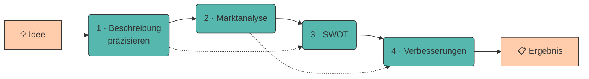

# Prompt Chaining

Komplexe Aufgaben lassen sich selten in einem einzigen Prompt lösen. Beim **Prompt Chaining** wird eine Aufgabe in **mehrere aufeinander aufbauende Schritte** zerlegt - das Ergebnis des einen Prompts wird zur Eingabe des nächsten.

Das ist dieselbe Idee wie beim Programmieren: Statt einer Funktion mit 300 Zeilen schreibst du fünf kleine, die du einzeln testen kannst.

---

## Warum ein Prompt oft nicht reicht

!!! quote "Merksatz"

    Ein LLM verteilt seine „Aufmerksamkeit" auf **alles**, was im Prompt steht. Fünf Aufgaben in einem Prompt heißen: jede bekommt ein Fünftel.

Bei einem großen Modell fällt das kaum auf. Bei `gemma3:1b` sofort:

<div class="grid" markdown>

!!! disadv "Alles auf einmal"

    ```{.text .no-copy}
    Analysiere meine Geschäftsidee (Bio-Lieferdienst in Innsbruck), erstelle eine Marktanalyse, mache eine SWOT-Analyse und leite daraus drei konkrete Verbesserungsvorschläge ab.
    ```

    **Ergebnis:** Alle vier Teile werden angerissen, keiner ausgeführt. Meist bricht das Modell nach der Marktanalyse ab oder wiederholt sich.

!!! adv "Als Kette"

    ```{.text .no-copy}
    Schritt 1 → Idee präzise beschreiben
    Schritt 2 → Marktanalyse (nutzt Ergebnis 1)
    Schritt 3 → SWOT (nutzt Ergebnis 1 + 2)
    Schritt 4 → Verbesserungen (nutzt Ergebnis 3)
    ```

    **Ergebnis:** Jeder Schritt bekommt die volle Aufmerksamkeit - und du kannst nach jedem Schritt korrigieren.

</div>

---

## Der Workflow



Der Ablauf beim Prompt Chaining ist nicht anders, als du es vermutlich schon häufig machst. Du beginnst mit einer Idee und hättest gerne ein fertiges Ergebnis. Dazwischen liegen mehrere Schritte (hier vier), und jeder davon ist ein **eigener Prompt** in einem frisch geleerten Chat. Die durchgezogenen Pfeile bilden die eigentliche Kette - was ein Schritt ausgibt, fügst du im nächsten wieder ein. Die gestrichelten Pfeile zeigen, dass eine Kette deshalb nicht streng linear sein muss: Schritt 3 braucht neben der Marktanalyse auch die präzisierte Beschreibung aus Schritt 1, und Schritt 4 stützt die Verbesserungsvorschläge nicht nur auf die SWOT, sondern zusätzlich auf die Marktzahlen aus Schritt 2. Jeder Schritt holt sich also genau die Vorergebnisse, die er wirklich braucht - **manchmal nur das letzte, manchmal zwei.**

---

## Vier Vorteile einer Kette

1. **Kontrollpunkte** - Nach jedem Schritt hältst du ein Zwischenergebnis in der Hand, das du lesen, prüfen und nachbessern kannst, bevor es weiterwandert. Beim Monolith bleibt dir nur die Wahl, die ganze Antwort zu akzeptieren oder komplett zu verwerfen. Wu et al. haben genau das untersucht: Chaining verbesserte nicht nur die Qualität der Ergebnisse, sondern vor allem, wie gut die Teilnehmenden nachvollziehen und eingreifen konnten.[^aichains]

2. **Fehler pflanzen sich nicht fort** - Erfindet das Modell in der Marktanalyse eine Zahl, fällt das auf, solange die Analyse noch für sich allein dasteht. Im Monolith fließt dieselbe Zahl unbemerkt in die SWOT und von dort in die Verbesserungsvorschläge - am Ende ist alles falsch, und du siehst nicht mehr, woher es kam. Der Vorteil liegt aber nur darin, dass du prüfen *kannst*: Wer die Zwischenschritte durchwinkt, hat die Fehlerkette trotzdem.

3. **Wiederverwendbarkeit** - Jeder Schritt ist ein eigenständiger Baustein mit klarer Ein- und Ausgabe. Dein SWOT-Prompt fragt nicht nach dem Bio-Lieferdienst, sondern nach „der Idee" - damit funktioniert er unverändert für jede weitere Idee, du tauschst nur die Eingabe. So wächst in deinem Laborbuch mit der Zeit eine Sammlung erprobter Bausteine.

4. **Kleinere Kontextfenster** - Jeder Prompt bekommt nur die Vorergebnisse, die er wirklich braucht, statt der gesamten bisherigen Unterhaltung. Das hält die Eingabe kurz und die Aufmerksamkeit des Modells beisammen - wichtig bei `gemma3:1b`, dessen [Kontextfenster](halluzinationen-kontextfenster.md) schnell voll ist und dann vorne Inhalte verliert.

---

## 🔬 Ollama-Lab

Alles ab hier drehst du an **deiner eigenen Geschäftsidee**. Die Beispiele oben im Kapitel zeigen das Verfahren - hier wendest du es an. Terminal auf, `ollama run gemma3:1b`, los.

!!! lab "Übung 1: Der Monolith - bewusst scheitern lassen"

    Verlange in **einem einzigen** Prompt alles auf einmal für deine Idee: (1) Marktanalyse, (2) SWOT-Analyse, (3) drei Verbesserungsvorschläge.

    **Prüfe:** Wie viele der drei Teile kommen wirklich brauchbar an? Wo bricht der Text ab?

    💡 **Falls der Monolith bei dir standhält:** Kurze Ideen mit wenig Kontext überfordern das Modell manchmal nicht genug. Dreh die Schraube fester - verlange zusätzlich genaue Formate je Teil (*„SWOT mit genau 2 Punkten pro Kategorie, Vorschläge je mit Erstem Schritt"*) und einen vierten Teil. Irgendwo bricht jede Kette; du sollst sehen, wo.


!!! lab "Übung 2: Dieselbe Aufgabe als Kette"

    Bevor du sie ausführst: Zeichne deine Kette **auf Papier**. Welche Schritte, welche Ein- und Ausgaben?

    Prüfe an der Skizze zwei Dinge, die sich später schwer korrigieren lassen:

    - Braucht ein Schritt außer dem letzten Zwischenergebnis auch noch die **Originalidee**? (Meist ja - das sind die gestrichelten Pfeile im Diagramm oben.)
    - Ist jede Ausgabe so formatiert, dass der **nächste** Schritt damit etwas anfangen kann?

    Jetzt in drei Schritten, jeder mit festem Format und `/clear` dazwischen:

     1. **Zielmarkt**: 3 Stichpunkte: Zielgruppe, Marktgröße, Wettbewerber
     2. **SWOT**: genau 2 Punkte je Kategorie
     3. **Verbesserungen**: 3 Vorschläge mit *Adressiert* und *Erster Schritt*

    **Jedes Zwischenergebnis kommt ins Laborbuch**, unter `## 05 Kette` - so:

    ```markdown title="lab_log.md → ## 05 Kette"
    ### Schritt 1 - Zielmarkt
    <Antwort des Modells>

    ### Schritt 2 - SWOT
    <Antwort des Modells>

    ### Schritt 3 - Verbesserungen
    <Antwort des Modells>
    ```

    Von dort kopierst du es in den nächsten Prompt. Das klingt umständlich, ist aber der Kern der Sache: **Du siehst jedes Zwischenergebnis, bevor es weiterwandert**

    **Vergleiche** das Endergebnis mit dem Monolith aus Übung 1.
    

??? code "🐍 Optional (Python): die Kette automatisieren"

    Zwischenergebnisse von Hand zu kopieren ist genau die Arbeit, die ein Skript abnimmt:

    ```python title="kette.py"
    from pathlib import Path
    from llm import frage

    IDEE = ("Lieferdienst für regionale Bio-Lebensmittel in Innsbruck, "
            "zwei Gründer, 15.000 € Startkapital, Lastenrad-Zustellung.")

    SCHRITTE = [
        ("markt", "Idee: {start}\n\nBeschreibe den Zielmarkt in genau 3 "
                  "Stichpunkten: Zielgruppe, Marktgröße, Wettbewerber."),
        ("swot",  "Idee: {start}\n\nMarktanalyse:\n{eingabe}\n\nErstelle eine "
                  "SWOT-Analyse. Genau 2 Punkte pro Kategorie.\nFormat:\n"
                  "STÄRKEN: ...\nSCHWÄCHEN: ...\nCHANCEN: ...\nRISIKEN: ..."),
        ("plan",  "SWOT:\n{eingabe}\n\nLeite daraus genau 3 konkrete "
                  "Verbesserungsvorschläge ab."),
    ]


    def kette(schritte, startwert):
        ergebnisse = {}
        eingabe = startwert

        for nummer, (name, vorlage) in enumerate(schritte, start=1):
            print(f"\n{'=' * 55}\nSCHRITT {nummer}/{len(schritte)}: {name}\n{'=' * 55}")

            antwort = frage(vorlage.format(eingabe=eingabe, start=startwert))
            if not antwort.strip():
                raise RuntimeError(f"Schritt '{name}' lieferte nichts zurück.")

            print(antwort)
            ergebnisse[name] = antwort
            eingabe = antwort          # Ergebnis wird Eingabe des nächsten Schritts

            Path(f"zwischenstand_{nummer}_{name}.txt").write_text(antwort, encoding="utf-8")

        return ergebnisse


    kette(SCHRITTE, IDEE)
    ```

    ```title="Ausgabe (gekürzt)"
    =======================================================
    SCHRITT 1/3: markt
    =======================================================
    - Zielgruppe: Berufstätige Haushalte in Innsbruck ...

    =======================================================
    SCHRITT 2/3: swot
    =======================================================
    STÄRKEN: Direkter Kontakt zu regionalen Produzenten ...

    =======================================================
    SCHRITT 3/3: plan
    =======================================================
    VORSCHLAG 1: Abo-Modell einführen ...
    ```

    Zwei Details lohnen sich zu merken:

    - **`{start}` bleibt in jedem Schritt verfügbar.** Manche Schritte brauchen die Originalidee *und* das letzte Zwischenergebnis - die gestrichelten Pfeile im Diagramm oben.
    - **Zwischenergebnisse landen als Textdatei auf der Platte.** Scheitert Schritt 3, startest du dort neu, statt die ganze Kette zu wiederholen. Das sind reine Arbeitsdateien - was du behalten willst, kopierst du ins `lab_log.md`.

---


## Quellen

Zur Ausarbeitung wurden generative Tools unterstützend eingesetzt.

[^aichains]: **Wu, T., Terry, M. & Cai, C. J. (2022):** *AI Chains: Transparent and Controllable Human-AI Interaction by Chaining Large Language Model Prompts.* CHI '22. [https://doi.org/10.1145/3491102.3517582](https://doi.org/10.1145/3491102.3517582) · arXiv:2110.01691 - das namensgebende Paper. In einer Studie mit 20 Personen verbesserte Chaining nicht nur die Ergebnisqualität, sondern vor allem **Transparenz und Steuerbarkeit** - die Kontrollpunkte aus Übung 3.
[^cot]: **Wei, J., Wang, X., Schuurmans, D. et al. (2022):** *Chain-of-Thought Prompting Elicits Reasoning in Large Language Models.* arXiv:2201.11903. [https://arxiv.org/abs/2201.11903](https://arxiv.org/abs/2201.11903) - der verwandte Ansatz **innerhalb** eines Prompts (siehe Kasten oben). Wichtig für uns: Der Effekt tritt erst ab etwa 100 Mrd. Parametern zuverlässig auf - bei unseren Modellen also nicht.
[^schulhoff]: **Schulhoff, S., Ilie, M., Balepur, N. et al. (2024):** *The Prompt Report: A Systematic Survey of Prompt Engineering Techniques.* arXiv:2406.06608. [https://arxiv.org/abs/2406.06608](https://arxiv.org/abs/2406.06608)
