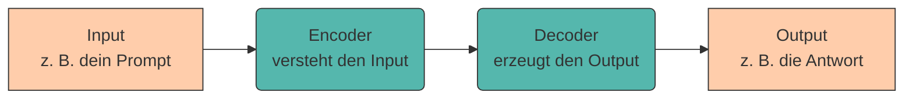
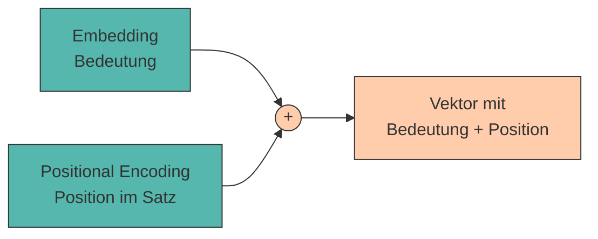
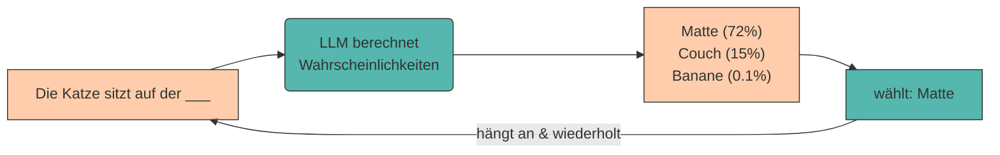
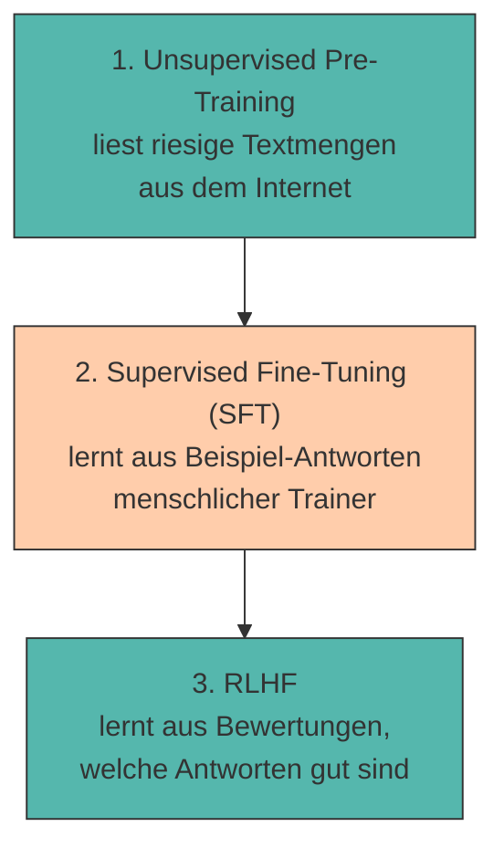
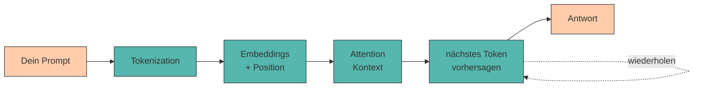

# Funktionsweise von LLMs

Die meisten, die ChatGPT zum ersten Mal benutzen, sind **beeindruckt**. Da sitzt scheinbar jemand am anderen Ende, der mühelos auf fast jede Frage antwortet – in fließendem Deutsch, Englisch oder Klingonisch, mal als Shakespeare, mal als SQL-Profi. Doch hinter dem freundlichen Chatfenster steckt kein kleiner Mensch, sondern **viel Mathematik, noch mehr Daten und ein bisschen Magie** (die wir gleich entzaubern).

Bevor wir lernen, wie man diese Werkzeuge mit guten **Prompts** zur Höchstform bringt, sollten wir verstehen, **was unter der Haube passiert**. Denn wer weiß, wie ein Motor funktioniert, fährt am Ende auch besser. 🏎️

!!! info "Grundlage dieses Kapitels"

    Dieses Kapitel orientiert sich inhaltlich an **Kapitel 3** des Buchs:

    > Zuckarelli, J. (2025): *Programmieren mit ChatGPT*. Kapitel 3 – „Funktionsweise des (Chat)GPT-Modells und anderer Large Language Models (LLMs)". Springer Nature. [https://doi.org/10.1007/978-3-662-69433-6_3](https://doi.org/10.1007/978-3-662-69433-6_3)

    Wir betrachten die Technik aus der **Vogelperspektive** – ohne Vorkenntnisse in linearer Algebra. Wer tiefer einsteigen will, findet die mathematischen Details in der Originalquelle.

---

## Drei Fähigkeiten, die beeindrucken

Wenn man ChatGPT & Co. genauer betrachtet, machen vor allem **drei Fähigkeiten** den beeindruckenden Eindruck aus (Zuckarelli, 2025):

1. natürliche Sprache **zu produzieren** – und das in vielen verschiedenen Sprachen,
2. den Input des Nutzers sprachlich und inhaltlich **zu verstehen**,
3. scheinbar **kreativ** tätig zu werden und Dinge zu erschaffen, die es so vorher nicht gab.

Während Maschinen Sprache schon länger übersetzen können (Google Translate, DeepL), ist besonders das *Verstehen* und das *kreative Erzeugen* neu. Schauen wir uns an, wie das gelingt.

## Das Zauberwort: Transformer 🤖

Das Herzstück moderner Sprachmodelle heißt **Transformer**. Und nein – damit ist **nicht** das Auto gemeint, das sich in einen Roboter verwandelt. 😉 Gemeint ist eine Architektur, die einen Input (Text, mittlerweile auch Bilder oder Audio) in einen Output **transformiert**.

Populär wurde der Transformer durch ein Paper mit dem wohl coolsten Titel der KI-Geschichte: **„Attention Is All You Need"** (Vaswani et al., 2017). Acht Google-Forscher legten damit den Grundstein für so ziemlich jeden Chatbot, den du heute kennst.

Grob besteht ein Transformer aus zwei Teilen:



- Der **Encoder** analysiert den Input und versteht ihn im Kontext.
- Der **Decoder** erzeugt daraus Wort für Wort den Output.

Wie kommt das Modell aber von „deinem Prompt" zu „dem Verständnis"? Dafür durchläuft der Text mehrere Stationen. Gehen wir sie der Reihe nach durch. 👇

---

## Station 1: Tokenization – Text in Häppchen zerlegen

Ein Computer kann mit Buchstaben nichts anfangen. Deshalb wird dein Text zuerst in kleine Bausteine zerlegt, sogenannte **Tokens**. Ein Token kann ein ganzes Wort sein – oft aber auch nur ein **Wortteil**.

???+ defi "Token & Vocabulary"

    Ein **Token** ist die kleinste Verarbeitungseinheit eines LLM. Jedes Token besitzt eine eindeutige ID im **Vocabulary** (dem „Wortschatz" des Modells).

    Faustregel: Im Englischen entspricht **1 Token ≈ 4 Zeichen ≈ ¾ Wort**. „Tokens" und „Wörter" sind also **nicht** dasselbe – auch wenn wir der Einfachheit halber manchmal von „Wörtern" sprechen.

Ein Beispiel mit dem Tokenizer, den OpenAI nutzt (Python-Bibliothek `tiktoken`):

```python
import tiktoken as tt

# "cl100k_base" ist das Tokenizer-Modell, das ChatGPT verwendet
enc = tt.get_encoding("cl100k_base")

encoded = enc.encode('He said: "Let me explain tokenization to you. It is comparably easy."')
# encoded enthält jetzt die Liste der Token-IDs, z. B. [1548, 1071, 25, ...]
```

Der Satz oben hat **68 Zeichen**, wird aber zu **17 Tokens** zerlegt. Wörter wie `tokenization` zerfallen dabei in mehrere Häppchen (`token` + `ization`).

???+ tip "Warum das für Prompt Engineering wichtig ist"

    LLMs rechnen **pro Token** ab und haben ein **Token-Limit** (das Kontextfenster). Wer das versteht, formuliert effizienter:

    - Lange, umständliche Prompts kosten mehr Tokens – und damit Geld und Platz im Kontextfenster.
    - Seltene Begriffe, Tippfehler und Sonderzeichen erzeugen oft **überraschend viele** Tokens.

    👉 Du kannst auf [platform.openai.com/tokenizer](https://platform.openai.com/tokenizer) live ausprobieren, wie dein Text zerlegt wird.

---

## Station 2: Word Embeddings – Wörtern Bedeutung geben

Tokens sind erstmal nur IDs – nackte Zahlen ohne Bedeutung. Damit das Modell mit *Bedeutung* arbeiten kann, wird jedes Token in einen **Vektor** aus vielen Zahlen übersetzt: das **Embedding**.

Man kann sich jedes Element des Vektors als einen **Aspekt** des Wortes vorstellen. Je höher der Wert, desto stärker ist dieser Aspekt ausgeprägt:

<div style="text-align:center; max-width:640px; margin:16px auto;">
<table role="table"
       style="width:100%; border-collapse:separate; border-spacing:0; border:1px solid #cfd8e3; border-radius:10px; overflow:hidden; font-family:system-ui,sans-serif;">
    <thead>
    <tr style="background:#009485; color:#fff;">
        <th style="text-align:left; padding:12px 14px; font-weight:700;">Wort</th>
        <th style="text-align:center; padding:12px 14px; font-weight:700;">🖥️ Technik</th>
        <th style="text-align:center; padding:12px 14px; font-weight:700;">👑 Macht</th>
        <th style="text-align:center; padding:12px 14px; font-weight:700;">🌿 Natur</th>
    </tr>
    </thead>
    <tbody>
    <tr>
        <td style="background:#00948511; padding:10px 14px; font-weight:600;">Programmierer</td>
        <td style="padding:10px 14px; text-align:center;">0.9</td>
        <td style="padding:10px 14px; text-align:center;">0.1</td>
        <td style="padding:10px 14px; text-align:center;">0.0</td>
    </tr>
    <tr>
        <td style="background:#00948511; padding:10px 14px; font-weight:600;">Entwickler</td>
        <td style="padding:10px 14px; text-align:center;">0.88</td>
        <td style="padding:10px 14px; text-align:center;">0.12</td>
        <td style="padding:10px 14px; text-align:center;">0.0</td>
    </tr>
    <tr>
        <td style="background:#00948511; padding:10px 14px; font-weight:600;">Wald</td>
        <td style="padding:10px 14px; text-align:center;">0.0</td>
        <td style="padding:10px 14px; text-align:center;">0.05</td>
        <td style="padding:10px 14px; text-align:center;">0.95</td>
    </tr>
    </tbody>
</table>
<figcaption>Stark vereinfachtes Beispiel. Echte Embeddings haben hunderte bis tausende Dimensionen – und sind <em>nicht</em> menschlich interpretierbar.</figcaption>
</div>

„Programmierer" und „Entwickler" haben **ähnliche** Vektoren – kein Wunder, sie bedeuten fast dasselbe. „Wald" zeigt in eine ganz andere Richtung.

Das Faszinierende: Mit Embeddings kann man sogar **rechnen**. Das berühmteste Beispiel:

$$\text{Vektor}(\text{König}) - \text{Vektor}(\text{Mann}) + \text{Vektor}(\text{Frau}) \approx \text{Vektor}(\text{Königin})$$

???+ example "Embedding-Mathematik zum Schmunzeln"

    Wenn du dem Modell „König" gibst, die „Männlichkeit" abziehst und „Weiblichkeit" addierst, landest du ungefähr bei „Königin". Sprache wird hier buchstäblich zur Vektor-Geometrie. 🤯

    Solche „Bedeutungsvektoren" wurden u. a. durch das Modell **Word2Vec** (Mikolov et al., 2013) bekannt.

!!! warning "Achtung: Blackbox"

    Welcher Aspekt in welchem Vektor-Element steckt, legt **kein Mensch** fest – das lernt das Modell selbst aus Daten. Wir können die Zuordnung nachträglich nicht sauber „abfragen". Das Modell ist insofern eine **Blackbox**.

---

## Station 3: Positional Encoding – die Reihenfolge zählt

Bedeutung allein reicht nicht. Vergleiche:

> „Hans fütterte das Eichhörnchen." 🐿️
> „Das Eichhörnchen fütterte Hans." 🐿️➡️🧑

Gleiche Wörter, **völlig andere Bedeutung** – nur die Reihenfolge ist anders (und in einem Fall ist Hans in Schwierigkeiten). Anders als ältere Ansätze (RNNs) verarbeitet der Transformer **alle Wörter gleichzeitig**. Das ist schnell, hat aber einen Haken: Ohne Zusatzinfo wüsste das Modell gar nicht mehr, **welches Wort wo stand**.

Die Lösung heißt **Positional Encoding**: Die Position eines Wortes wird über (Sinus-/Kosinus-)Werte direkt in seinen Embedding-Vektor **hineingerechnet**. So tragen die Vektoren ab jetzt zwei Informationen: *Was* bedeutet das Wort **und** *wo* steht es im Satz.



---

## Station 4: Attention – Bedeutung im Kontext ⭐

Jetzt kommt der Teil, der dem Paper seinen Namen gab. Bisher hat jedes Wort einen Vektor, der seine Bedeutung und Position kennt. Aber die wahre Stärke von LLMs liegt darin, Wörter **im Kontext der anderen Wörter** zu verstehen.

Das Lieblingsbeispiel dafür ist das Wort **„Bank"**:

<div class="grid cards" markdown>

- :material-cash: **„Ich gehe zur Bank und hebe Geld ab."**

    ---

    Kontext: *Geld, abheben* → gemeint ist das **Finanzinstitut** 🏦

- :material-tree: **„Ich setze mich auf die Bank im Park."**

    ---

    Kontext: *Park, sitzen* → gemeint ist das **Sitzmöbel** 🪑

</div>

Aus dem Wort „Bank" allein lässt sich das nicht erkennen – nur aus dem **Kontext**. Genau das leistet die **(Self-)Attention**: Sie passt den Embedding-Vektor jedes Wortes ein wenig an, indem sie ihn in Richtung der **relevanten Nachbarwörter** verschiebt.

???+ defi "Self-Attention (vereinfacht)"

    Jedes Wort „schaut" auf alle anderen Wörter im Satz und fragt: *Wie wichtig bist du für meine Bedeutung?* Anschließend wird die eigene Bedeutung als **gewichteter Mittelwert** der anderen Wörter angepasst.

    Technisch geschieht das über drei Matrizen – **Query (Q)**, **Key (K)** und **Value (V)** – und eine **Softmax**-Funktion, die die Gewichte normiert (sodass sie sich zu 1 addieren). In der Praxis passiert das mehrfach parallel und wird zur **Multihead Attention** zusammengesetzt.

Du musst die Matrizenrechnung nicht auswendig können. Wichtig ist die Intuition:

!!! quote "Merksatz"

    **Ein Wort bekommt seine endgültige Bedeutung erst durch seine Nachbarn.** Genau deshalb ist *Kontext* im Prompt so mächtig – mehr dazu im Kapitel [Anatomie eines guten Prompts](anatomie.md).

---

## Station 5: Das nächste Token – ein Wort nach dem anderen

Jetzt versteht das Modell deinen Input. Aber wie entsteht die **Antwort**? Überraschend simpel: Das Modell sagt immer nur das **nächste Token** voraus – und zwar das mit der **höchsten Wahrscheinlichkeit**.

Dann hängt es dieses Token an den bisherigen Text an, schaut erneut, sagt das nächste Token voraus – und so weiter. Wie eine sehr, sehr gute Autovervollständigung. 📱



Das Spiel läuft so lange, bis ein spezielles **Stop-Token** erzeugt wird – das Signal: „Antwort fertig."

???+ question "Quiz: Halluzinationen vorhergesagt 🔮"

    Wenn ein LLM einfach nur das **wahrscheinlichste nächste Token** wählt – warum „erfindet" es dann manchmal selbstbewusst falsche Fakten (sogenannte *Halluzinationen*)?

    ??? success "Antwort anzeigen"

        Weil das Modell auf **sprachliche Wahrscheinlichkeit** optimiert ist, nicht auf **Wahrheit**. Es erzeugt das, was *plausibel klingt* – nicht das, was *nachweislich stimmt*. Eine flüssig formulierte Falschaussage ist für das Modell „wahrscheinlich", auch wenn sie sachlich Unsinn ist.

        👉 Genau deshalb ist **Verifikation** ein eigenes Thema – siehe Kapitel [Evaluation von KI-Ergebnissen](evaluation.md).

---

## Wie wird ein LLM eigentlich klug? Das Training 🎓

Die beeindruckenden Fähigkeiten stecken in **Milliarden von Parametern** (GPT-3.5 z. B. ~175 Milliarden). Diese Werte entstehen in drei Trainingsphasen (Zuckarelli, 2025):



=== "1. Unsupervised Pre-Training"

    Das Modell liest **enorme Mengen** an Text aus dem Internet (z. B. Wikipedia und den gefilterten *Common Crawl Corpus*) und lernt nur eine Aufgabe: **„Was ist das nächste Wort?"**

    Dabei „lernt" es sein Wissen – nicht explizit abgespeichert wie in einer Datenbank, sondern **implizit** in den Parametern. Das „P" und „T" in **GPT** stehen übrigens für *Pre-trained Transformer*. Diese Phase dauert **Monate** und verschlingt gigantische Mengen an Rechenleistung und Energie. ⚡

=== "2. Supervised Fine-Tuning (SFT)"

    Ein roh trainiertes Modell folgt Anweisungen oft schlecht (es antwortet auf „Was ist die Hauptstadt von Portugal?" gern mit einer Gegenfrage, weil so etwas in Quizzen häufig vorkommt 🙃).

    Deshalb wird es mit **tausenden Prompt-Antwort-Paaren** nachtrainiert, die menschliche Trainer erstellt haben. So entstand z. B. **InstructGPT** – ein Modell, das wirklich *tut, was man sagt*.

=== "3. RLHF"

    In der letzten Phase erzeugt das Modell mehrere Antworten, und Menschen **bewerten** sie. Aus diesen Bewertungen wird ein **Reward Model** trainiert, das dem LLM beibringt, welche Antworten gut ankommen.

    *Reinforced Learning with Human Feedback* (RLHF) macht Antworten nicht nur hilfreicher, sondern reduziert auch **faktisch falsche Aussagen** (Halluzinationen).

???+ tip "Der „B"-Trick in Modellnamen"

    Wenn du in Modellnamen ein „**B**" siehst (z. B. *LLaMA-3.1-405B*), steht das für *billion* – also die Anzahl der **Parameter** in Milliarden. Mehr Parameter = mehr implizit speicherbares Wissen und feinere Nuancen, aber auch teurer und langsamer.

---

## Zusammenfassung: Der Weg vom Prompt zur Antwort



???+ question "Selbsttest: Hast du den Motor verstanden?"

    1. Was ist der Unterschied zwischen einem **Token** und einem **Wort**?
    2. Warum brauchen Transformer ein **Positional Encoding**?
    3. Erkläre in einem Satz, was **Attention** am Beispiel „Bank" leistet.
    4. Warum ist ein LLM auf **Plausibilität** und nicht auf **Wahrheit** optimiert?

    ??? success "Lösungsskizze"

        1. Ein Token ist die kleinste Verarbeitungseinheit – oft nur ein **Wortteil**. Ein Wort kann aus mehreren Tokens bestehen.
        2. Weil der Transformer alle Wörter **gleichzeitig** verarbeitet und sonst die **Reihenfolge** verlieren würde.
        3. Attention passt die Bedeutung von „Bank" an die Nachbarwörter an – *Geld* → Finanzinstitut, *Park* → Sitzmöbel.
        4. Weil es darauf trainiert wurde, das **wahrscheinlichste nächste Token** zu erzeugen – sprachlich plausibel ≠ inhaltlich korrekt.

---

## Quellen

!!! info "Literatur"

    Dieses Kapitel basiert auf folgenden Quellen:

    - **Zuckarelli, J. (2025):** *Programmieren mit ChatGPT*, Kapitel 3 – „Funktionsweise des (Chat)GPT-Modells und anderer Large Language Models (LLMs)". Springer Nature. [https://doi.org/10.1007/978-3-662-69433-6_3](https://doi.org/10.1007/978-3-662-69433-6_3)
    - **Vaswani, A. et al. (2017):** *Attention Is All You Need.* arXiv:1706.03762. [https://arxiv.org/abs/1706.03762](https://arxiv.org/abs/1706.03762)
    - **Mikolov, T. et al. (2013):** *Efficient Estimation of Word Representations in Vector Space.* arXiv:1301.3781. [https://arxiv.org/abs/1301.3781](https://arxiv.org/abs/1301.3781)
    - **Ouyang, L. et al. (2022):** *Training language models to follow instructions with human feedback.* arXiv:2203.02155. [https://arxiv.org/abs/2203.02155](https://arxiv.org/abs/2203.02155)

    Zur Ausarbeitung wurden generative Tools unterstützend eingesetzt.
