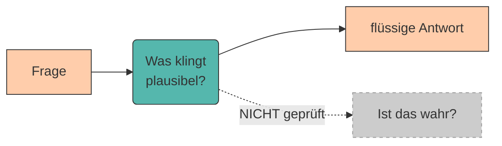
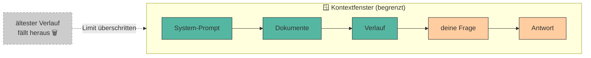

# Halluzinationen und Kontextfenster

Zwei Begriffe begegnen dir im Umgang mit LLMs immer wieder – und beide entscheiden darüber, ob du der KI **vertrauen** kannst: **Halluzinationen** und das **Kontextfenster**. Das eine erklärt, warum ein Modell selbstbewusst Unsinn erzählt; das andere, warum es mitten im Gespräch plötzlich „vergisst", worüber ihr gerade gesprochen habt.

Wer diese beiden Phänomene versteht, schreibt nicht nur bessere Prompts – er fällt auch seltener auf die KI herein. 🕵️

!!! info "Grundlage dieses Kapitels"

    Dieses Kapitel stützt sich auf drei Quellen:

    > Zuckarelli, J. (2025): *Programmieren mit ChatGPT.* Springer Nature. [https://doi.org/10.1007/978-3-662-69433-6](https://doi.org/10.1007/978-3-662-69433-6)

    > Lappin, S. (2024): *Assessing the Strengths and Weaknesses of Large Language Models.* Journal of Logic, Language and Information 33, S. 9–20. [https://doi.org/10.1007/s10849-023-09409-x](https://doi.org/10.1007/s10849-023-09409-x)

    > Kessel, T. et al. (2025): *ChatGPT und Large Language Models? Frag doch einfach!* UVK Verlag (UTB).

---

## Teil 1: Halluzinationen 🦄

### Was ist eine Halluzination?

???+ defi "Halluzination"

    Als **Halluzination** bezeichnet man eine Antwort, die **flüssig und überzeugend** klingt, faktisch aber **falsch oder frei erfunden** ist. Das Modell „lügt" dabei nicht im menschlichen Sinn – es hat schlicht kein Konzept von *wahr* und *falsch*.

### Warum halluzinieren LLMs überhaupt?

Erinnerst du dich an die [Funktionsweise](funktionsweise-llms.md)? Ein LLM macht im Kern nur eines: Es sagt das **wahrscheinlichste nächste Token** voraus. Es ist also auf **sprachliche Plausibilität** optimiert – nicht auf **Wahrheit**.

Eine flüssig formulierte Falschaussage ist für das Modell **genauso „wahrscheinlich"** wie eine korrekte – Hauptsache, sie klingt richtig (Kessel et al., 2025). Das Modell verarbeitet Anweisungen **rein statistisch** und völlig unabhängig von deren **Inhalt**.

!!! warning "Achtung: Grounding ≠ Wahrheit"

    Selbst multimodale Modelle, die Text mit Bildern „erden" (Grounding), sind davor nicht gefeit. Lappin (2024) bringt es auf den Punkt: Die Beschreibung des Bildes eines **Einhorns** kann das Bild völlig korrekt beschreiben – und trotzdem **kein real existierendes Tier** charakterisieren. 🦄

### Berühmte Halluzinationen

???+ example "Der Anwalt und die erfundenen Urteile ⚖️"

    Ein New Yorker Anwalt ließ ChatGPT Präzedenzfälle für eine Klage gegen die Airline **Avianca** recherchieren. Prompt geliefert: **sechs** juristisch perfekt formulierte Urteile – von denen **kein einziges existierte**. Auf die Nachfrage „Sind diese Fälle echt?" antwortete ChatGPT: *„Ja."* Vor Gericht flog alles auf. (Lappin, 2024; Fall *Mata v. Avianca*, 2023)

???+ example "Der Klassiker: die erfundene Quelle 📚"

    Bittest du ein LLM um Literatur zu einem Nischenthema, bekommst du oft Titel, Autor:innen, Jahr und sogar eine **DOI** – alles makellos formatiert, alles **ausgedacht**. Wissenschaftlich besonders heikel, weil es so **echt aussieht**.

### Was hilft gegen Halluzinationen?

Die gute Nachricht: Man ist ihnen nicht hilflos ausgeliefert.

???+ adv "Strategien gegen Halluzinationen"

    - **Kontext mitgeben:** Liefere die Fakten/Dokumente gleich im Prompt mit, statt das Modell aus dem „Gedächtnis" raten zu lassen.
    - **Verifizieren:** Jede faktische Aussage (Zahlen, Zitate, Namen, Quellen) gegenprüfen. → Kapitel [Evaluation von KI-Ergebnissen](evaluation.md)
    - **Quellen verlangen:** Nach überprüfbaren Belegen fragen – und diese tatsächlich anklicken.
    - **Unsicherheit zulassen:** Das Modell explizit auffordern, „Ich weiß es nicht" zu sagen, statt zu raten.

!!! tip "Training reduziert – beseitigt aber nicht"

    Modernes Training (insbesondere **RLHF**, siehe [Funktionsweise](funktionsweise-llms.md)) reduziert das Ausmaß faktisch falscher Antworten deutlich (Zuckarelli, 2025). **Verschwunden sind Halluzinationen damit aber nicht** – die Verantwortung für die Faktenprüfung bleibt bei dir.

---

## Teil 2: Das Kontextfenster 🪟

### Was ist das Kontextfenster?

Ein LLM hat kein dauerhaftes Gedächtnis. Alles, was es „weiß", während es deine Anfrage bearbeitet, passt in ein begrenztes **Kontextfenster** – gemessen in **Tokens** (erinnerst du dich an die [Tokenization](funktionsweise-llms.md)?).

???+ defi "Kontextfenster & Token-Limit"

    Das **Kontextfenster** ist die maximale Menge an Text (in **Tokens**), die ein Modell **gleichzeitig** verarbeiten kann – das **unterhaltungsbezogene „Gedächtnis"** (Zuckarelli, 2025).

    Es umfasst **alles**: deinen Prompt, mitgegebene Dokumente, den bisherigen Gesprächsverlauf **und** die Antwort des Modells. Ist das **Token-Limit** erreicht, fällt vorne etwas heraus – das Modell **„vergisst"** die ältesten Teile des Dialogs.

### Woran merkst du, dass das Fenster voll ist?

Ein verräterisches Symptom ist das **Déjà-vu**: Wenn ChatGPT plötzlich Lösungen vorschlägt, die ihr **längst verworfen** habt, oder wichtige Vorgaben aus dem Gesprächsverlauf ignoriert – dann ist das oft der stärkste Indikator dafür, dass die **Kontextlänge erreicht** ist (Zuckarelli, 2025).

### Wie groß ist so ein Fenster?

Das hängt stark vom Modell ab und wächst rasant – von wenigen tausend Tokens bei frühen Modellen bis zu **Hunderttausenden oder Millionen** Tokens bei aktuellen Modellen.

!!! warning "Größer ist nicht gratis"

    Die Nutzung wird in der Regel **pro Token** abgerechnet (Input **und** Output). Ein riesiges Dokument in jeden Prompt zu kippen, kostet also Geld – und kann die Antwort verlangsamen (Zuckarelli, 2025). **Mehr Kontext ist nicht automatisch besser.**

### Strategien zum Managen des Kontextfensters

Auch hier gilt: Mit ein paar Techniken behältst du die Kontrolle (Zuckarelli, 2025, Kap. 6.4).

???+ process "So managst du das Token-Limit"

    1. **Aktuellen Stand wiederholen** – bring das Modell „auf den neuesten Stand", z. B. mit `This is the current code/version` und dem aktuellen Inhalt.
    2. **Zwischen-Zusammenfassungen** – fasse den bisherigen Dialog kompakt zusammen, statt den ganzen Verlauf mitzuschleppen.
    3. **Abschnittsweise arbeiten** – große Texte/Codebasen modular, Stück für Stück bearbeiten.
    4. **Neuen Chat starten** – bei „Verrennen": relevanten Inhalt in einen frischen Chat kopieren (das löscht den Altlasten-Kontext).
    5. **Größeres Modell wählen** – ein Modell mit größerem Kontextfenster nutzen, wenn die Aufgabe es wirklich braucht.

---

## Wie Halluzinationen und Kontextfenster zusammenhängen 🔗

Die beiden Themen sind enger verbandelt, als es scheint: **Läuft das Kontextfenster über**, verliert das Modell wichtige Informationen aus dem Gespräch – und füllt die Lücken dann gern mit … **Halluzinationen**. Ein überquellender Kontext ist also nicht nur ein „Gedächtnisproblem", sondern auch ein **Risikofaktor für erfundene Inhalte**.

!!! quote "Merksatz"

    **Gib dem Modell genau den Kontext, den es braucht – nicht mehr, nicht weniger.** Zu wenig → es rät (Halluzination). Zu viel → es vergisst (Kontext-Überlauf) und kostet unnötig.

---

## Was heißt das für Prompt Engineering? 🎯

- **Gegen Halluzinationen:** relevanten **Kontext mitliefern**, **Quellen verlangen**, Ergebnisse **verifizieren**.
- **Fürs Kontextfenster:** Prompts **knapp und fokussiert** halten, lange Aufgaben **zerlegen**, bei langen Sessions **zusammenfassen** oder neu starten.

Beides läuft auf dieselbe Kernkompetenz hinaus: **bewusst steuern, was das Modell weiß** – genau darum geht es im nächsten Kapitel [Anatomie eines guten Prompts](anatomie.md).

???+ question "Selbsttest"

    1. Warum ist ein LLM auf *Plausibilität* statt auf *Wahrheit* optimiert?
    2. Was steckt **alles** im Kontextfenster – nenne mindestens drei Bestandteile.
    3. Welches Symptom verrät dir, dass das Kontextfenster voll ist?
    4. Nenne zwei Strategien gegen Halluzinationen **und** zwei gegen Kontext-Überlauf.

    ??? success "Lösungsskizze"

        1. Weil es darauf trainiert ist, das **wahrscheinlichste nächste Token** zu erzeugen – sprachlich plausibel ≠ inhaltlich korrekt.
        2. System-Prompt, mitgegebene Dokumente, bisheriger Gesprächsverlauf, die aktuelle Frage **und** die Antwort.
        3. **Déjà-vu**: Das Modell wiederholt bereits verworfene Vorschläge oder ignoriert frühere Vorgaben.
        4. *Gegen Halluzinationen:* Kontext mitgeben, verifizieren, Quellen verlangen. *Gegen Überlauf:* zusammenfassen, abschnittsweise arbeiten, neuen Chat starten, größeres Modell.

---

## Quellen

!!! info "Literatur"

    Dieses Kapitel basiert auf folgenden Quellen:

    - **Zuckarelli, J. (2025):** *Programmieren mit ChatGPT.* Springer Nature, u. a. Kap. 3 und Kap. 6.4 „Token-Limit managen". [https://doi.org/10.1007/978-3-662-69433-6](https://doi.org/10.1007/978-3-662-69433-6)
    - **Lappin, S. (2024):** *Assessing the Strengths and Weaknesses of Large Language Models.* Journal of Logic, Language and Information 33, S. 9–20. [https://doi.org/10.1007/s10849-023-09409-x](https://doi.org/10.1007/s10849-023-09409-x) (CC BY 4.0)
    - **Kessel, T.; Brandt, A.; Offtermatt, J.; Augenstein, F.; Praeg, C. (2025):** *ChatGPT und Large Language Models? Frag doch einfach!* UVK Verlag (UTB), Kapitel „Stärken und Schwächen von LLMs", S. 130–141. ISBN 978-3-8252-6276-1.

    Zur Ausarbeitung wurden generative Tools unterstützend eingesetzt.
