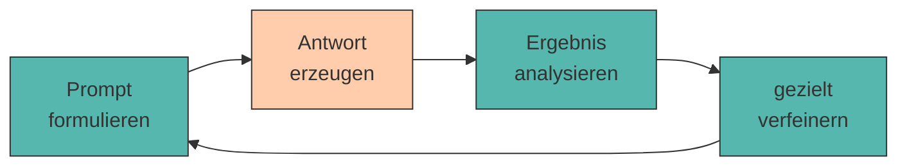

# 4. Iteratives Prompt Engineering

Der erste Prompt ist selten der beste. Gute Ergebnisse entstehen meist **schrittweise** – durch gezieltes Verbessern, Analysieren und Verfeinern.

Das ist keine Schwäche der Methode, sondern ihr Wesen. Auch erfahrene Prompt Engineers schreiben selten den perfekten Prompt beim ersten Versuch. Der Unterschied: Sie verbessern **systematisch** statt zufällig.

---

## Der Zyklus



!!! warning "Die häufigste Anti-Methode"

    Prompt schreiben → Ergebnis gefällt nicht → **alles neu schreiben** → Ergebnis gefällt immer noch nicht → wieder alles neu.

    Das Problem: Du weißt am Ende nicht, **welche** Änderung was bewirkt hat. Du drehst an fünf Schrauben gleichzeitig und wunderst dich über das Ergebnis.

    👉 Ändere pro Iteration **genau eine Sache**.

???+ defi "Das ist keine Anfängerschwäche – es ist der Normalfall"

    Zamfirescu-Pereira et al.[^johnny] haben untersucht, wie Menschen ohne KI-Hintergrund tatsächlich prompten. Drei Muster traten regelmäßig auf:

    - **Opportunistisches Ausprobieren** statt systematischem Vorgehen – man ändert, was gerade auffällt.
    - **Übergeneralisierung aus Einzelfällen**: Ein einziger guter Durchlauf gilt als Beweis, dass der Prompt funktioniert.
    - **Vermenschlichung**: Man erklärt dem Modell die Aufgabe so, wie man sie einem Menschen erklären würde – inklusive Andeutungen, die es nicht auflösen kann.

    Das zweite Muster ist besonders tückisch, weil Sprachmodelle [nicht deterministisch](ollama-setup.md) sind. Deshalb im Zweifel: **jede Variante mehrfach laufen lassen.**

---

## Output analysieren

Bevor du etwas änderst, benenne **präzise**, was nicht stimmt. Die meisten Probleme fallen in eine dieser fünf Kategorien:

<div style="text-align:center; max-width:780px; margin:16px auto;">
<table role="table"
       style="width:100%; border-collapse:separate; border-spacing:0; border:1px solid #cfd8e3; border-radius:10px; overflow:hidden; font-family:system-ui,sans-serif;">
    <thead>
    <tr style="background:#009485; color:#fff;">
        <th style="text-align:left; padding:12px 14px; font-weight:700;">Symptom</th>
        <th style="text-align:left; padding:12px 14px; font-weight:700;">Wahrscheinliche Ursache</th>
        <th style="text-align:left; padding:12px 14px; font-weight:700;">Gegenmittel</th>
    </tr>
    </thead>
    <tbody>
    <tr>
        <td style="background:#00948511; padding:10px 14px; font-weight:600;">Zu allgemein</td>
        <td style="padding:10px 14px;">Kontext fehlt</td>
        <td style="padding:10px 14px;">Situation, Zielgruppe, Zahlen ergänzen</td>
    </tr>
    <tr>
        <td style="background:#00948511; padding:10px 14px; font-weight:600;">Falsches Format</td>
        <td style="padding:10px 14px;">Format nicht vorgemacht</td>
        <td style="padding:10px 14px;">Muster vorgeben oder <a href="shot-prompting.md">Few-Shot</a></td>
    </tr>
    <tr>
        <td style="background:#00948511; padding:10px 14px; font-weight:600;">Zu lang / zu kurz</td>
        <td style="padding:10px 14px;">keine Umfangsvorgabe</td>
        <td style="padding:10px 14px;">„genau 5 Punkte", <code>num_predict</code></td>
    </tr>
    <tr>
        <td style="background:#00948511; padding:10px 14px; font-weight:600;">Erfundene Fakten</td>
        <td style="padding:10px 14px;">Wissenslücke wird gefüllt</td>
        <td style="padding:10px 14px;">Quellen mitgeben, <code>[UNBEKANNT]</code> erlauben</td>
    </tr>
    <tr>
        <td style="background:#00948511; padding:10px 14px; font-weight:600;">Thema verfehlt</td>
        <td style="padding:10px 14px;">Aufgabe mehrdeutig</td>
        <td style="padding:10px 14px;">Verb schärfen, Aufgabe zerlegen</td>
    </tr>
    </tbody>
</table>
</div>

---

## Verfeinerungsstrategien

???+ process "Fünf Werkzeuge für die nächste Iteration"

    1. **Hinzufügen** – der fehlende [Baustein](anatomie.md) (meist Kontext oder Format).
    2. **Verschärfen** – vage Verben durch präzise ersetzen: *analysieren* → *drei Risiken nennen und je einen Satz begründen*.
    3. **Zerlegen** – ein Prompt macht zu viel auf einmal → in zwei Prompts aufteilen ([Chaining](chaining.md)).
    4. **Vormachen** – statt zu beschreiben, ein Beispiel liefern ([Few-Shot](shot-prompting.md)).
    5. **Weglassen** – überflüssige Höflichkeitsfloskeln und Wiederholungen streichen. Bei kleinen Modellen verwässert Ballast die eigentliche Anweisung.[^sahoo]

!!! tip "Das Modell als Prompt-Kritiker"

    Du kannst die KI ihre eigene Antwort bewerten lassen:

    > *„Hier ist mein Prompt und die Antwort. Welche Information fehlte dir, um eine bessere Antwort zu geben? Nenne genau drei Punkte."*

    Dieses Prinzip – erzeugen, selbst kritisieren, überarbeiten – ist als *Self-Refine* auch wissenschaftlich untersucht.[^madaan] Bei kleinen Modellen ist das Ergebnis mit Vorsicht zu genießen, aber es liefert oft überraschend brauchbare Hinweise auf fehlenden Kontext.

---

## Dokumentieren: das Prompt-Logbuch

Ohne Protokoll verlierst du nach der dritten Iteration den Überblick. Halte für jede Runde fest: **was geändert – was bewirkt**.

```markdown title="prompt_log.md"
## Iteration 1 – Baseline
Prompt: "Erstelle ein Business Model Canvas für meinen Bio-Lieferdienst."
Ergebnis: 4 von 9 Feldern, sehr allgemein, teilweise Englisch.
Problem: Modell kennt die 9 Felder nicht sicher.

## Iteration 2 – Felder explizit vorgeben
Änderung: alle 9 Feldnamen im Prompt aufgelistet.
Ergebnis: 9 von 9 Feldern ✅, Inhalt aber noch generisch.
Problem: fehlender Kontext.

## Iteration 3 – Kontext ergänzt
Änderung: Standort, Zielgruppe, Startkapital hinzugefügt.
Ergebnis: konkret und brauchbar. ⭐ Bester Prompt bisher.
```

---

## 🔬 Ollama-Labor

!!! example "Übung 1: Eine Schraube pro Runde"

    Verbessere einen bewusst schlechten Prompt in vier Iterationen – jeweils mit **genau einer** Änderung. Deine Messgröße: **Wie viele der neun Canvas-Felder** kommen tatsächlich vor?

    **Runde 1 – Baseline:**

    ```bash
    ollama run qwen2.5:0.5b "Mach ein Business Model Canvas für einen Bio-Lieferdienst."
    ```

    ```title="Beispielausgabe — 3/9 Feldern"
    Ein Business Model Canvas hilft dabei, ein Geschäftsmodell zu strukturieren.
    Für einen Bio-Lieferdienst wären die Kundensegmente vor allem
    umweltbewusste Verbraucher. Das Wertangebot besteht in frischen,
    regionalen Produkten. Die Kostenstruktur umfasst Logistik und Personal.
    ```

    **Runde 2 – die neun Felder explizit vorgeben:**

    ```title="Terminal"
    >>> /clear
    >>> """
    ... Erstelle ein Business Model Canvas für einen Bio-Lieferdienst.
    ... Fülle genau diese 9 Felder aus: Kundensegmente, Wertangebot, Kanäle,
    ... Kundenbeziehungen, Einnahmequellen, Schlüsselressourcen,
    ... Schlüsselaktivitäten, Schlüsselpartner, Kostenstruktur.
    ... """
    ```

    ```title="Beispielausgabe — 9/9 Feldern, aber generisch"
    Kundensegmente: Umweltbewusste Verbraucher aller Altersgruppen.
    Wertangebot: Frische Bio-Produkte, bequem geliefert.
    Kanäle: Website, App, Social Media.
    Kundenbeziehungen: Persönlicher Service und Kundenbindung.
    ...
    ```

    **Runde 3 – Kontext ergänzen:**

    ```title="Terminal"
    >>> /clear
    >>> """
    ... Erstelle ein Business Model Canvas.
    ...
    ... KONTEXT: Zwei-Personen-Startup in Innsbruck, Lieferdienst für regionale
    ... Bio-Lebensmittel, 15.000 € Startkapital, Zielgruppe berufstätige Familien.
    ...
    ... Fülle genau diese 9 Felder aus: Kundensegmente, Wertangebot, Kanäle,
    ... Kundenbeziehungen, Einnahmequellen, Schlüsselressourcen,
    ... Schlüsselaktivitäten, Schlüsselpartner, Kostenstruktur.
    ... """
    ```

    ```title="Beispielausgabe — 9/9 Feldern, jetzt konkret"
    Kundensegmente: Berufstätige Familien in Innsbruck mit wenig Einkaufszeit.
    Wertangebot: Regionale Bio-Ware bis an die Wohnungstür, ohne Supermarktbesuch.
    Kanäle: Eigene Website, Direktvertrieb auf dem Wochenmarkt.
    ...
    Schlüsselpartner: Bauernhöfe im Inntal, lokale Imkerei.
    Kostenstruktur: Fahrzeug, Kühlung, Verpackung – begrenzt durch 15.000 €.
    ```

    **Runde 4:** Ergänze zusätzlich ein Format (`<Feldname>: <maximal 15 Wörter>`) und *„Keine Einleitung, keine Erklärung."*

    **Deine Aufgabe:** Führe alle vier Runden durch und zähle jedes Mal die Felder. Zwischen welchen beiden Runden springt die Zahl am stärksten – und zwischen welchen springt die **Qualität** am stärksten? (Achtung: Das sind nicht dieselben Runden.)

!!! example "Übung 2: Das Modell kritisiert sich selbst"

    Ein überraschend nützlicher Trick, wenn du nicht weiterkommst: Lass die KI sagen, was ihr fehlte.

    ```title="Terminal"
    >>> Beschreibe meine Geschäftsidee.
    ```

    ```title="Beispielausgabe"
    Gerne helfe ich dabei! Allerdings liegen mir keine Informationen zu Ihrer
    Geschäftsidee vor. Eine Geschäftsidee beschreibt üblicherweise ...
    ```

    Jetzt die Rückfrage im selben Chat:

    ```title="Terminal"
    >>> Welche drei Informationen hätte ich dir mitliefern müssen, damit deine
    ... Antwort konkret und nützlich wird? Nummerierte Liste, ein Satz pro Punkt.
    ```

    ```title="Beispielausgabe"
    1. Um welches Produkt oder welche Dienstleistung es sich handelt.
    2. Wer die Zielgruppe ist und welches Problem für sie gelöst wird.
    3. Wie das Unternehmen Geld verdienen soll.
    ```

    Das sind – nicht zufällig – genau die Bausteine aus [Kapitel 2](anatomie.md).

    **Deine Aufgabe:** Wende denselben Trick auf deinen eigenen schwächsten Prompt an. Sind die Vorschläge brauchbar? Teste es zusätzlich mit `llama3.2:1b` – wie groß ist der Unterschied?

??? code "🐍 Optional (Python): Prompts automatisch bewerten"

    Sobald du eine **Zahl** hast, kannst du Prompts objektiv vergleichen, statt nach Bauchgefühl zu urteilen. Genau dieses Prinzip steckt hinter professionellen Prompt-Evaluationen.

    ```python title="bewerter.py"
    from llm import frage

    FELDER = ["Kundensegmente", "Wertangebot", "Kanäle", "Kundenbeziehungen",
              "Einnahmequellen", "Schlüsselressourcen", "Schlüsselaktivitäten",
              "Schlüsselpartner", "Kostenstruktur"]


    def bewerte(antwort, pflichtbegriffe=FELDER, max_woerter=200):
        text = antwort.lower()

        # 1) Inhalt: wie viele Pflichtbegriffe kommen vor?
        treffer = sum(1 for b in pflichtbegriffe if b.lower() in text)
        inhalt = treffer / len(pflichtbegriffe)

        # 2) Länge: Überlänge wird proportional bestraft
        woerter = len(antwort.split())
        laenge = 1.0 if woerter <= max_woerter else max_woerter / woerter

        # 3) Gewichtet kombinieren – Inhalt zählt doppelt
        score = (inhalt * 2 + laenge) / 3 * 100

        print(f"Felder: {treffer}/{len(pflichtbegriffe)} · "
              f"Wörter: {woerter}/{max_woerter} · Score: {score:.0f}")
        return round(score)


    for runde, prompt in enumerate(ITERATIONEN, start=1):
        print(f"\nRunde {runde}:", end=" ")
        bewerte(frage(prompt))
    ```

    ```title="Ausgabe"
    Runde 1: Felder: 3/9 · Wörter: 61/200 · Score: 56
    Runde 2: Felder: 9/9 · Wörter: 128/200 · Score: 100
    Runde 3: Felder: 9/9 · Wörter: 141/200 · Score: 100
    Runde 4: Felder: 9/9 · Wörter: 97/200 · Score: 100
    ```

    **Achtung, wichtige Lehre:** Ab Runde 2 ist der Score bei 100 – aber du hast oben gesehen, dass Runde 3 inhaltlich **deutlich** besser ist als Runde 2. Eine Metrik misst nur das, was sie misst. Sie ersetzt das Lesen nicht, sie priorisiert es nur.

---

???+ question "Selbsttest"

    1. Warum solltest du pro Iteration nur eine Änderung vornehmen?
    2. Die Antwort ist inhaltlich gut, aber viel zu lang. Welche Verfeinerungsstrategie greift?
    3. Wozu dient ein Prompt-Logbuch?

    ??? success "Lösungsskizze"

        1. Weil du sonst nicht zuordnen kannst, welche Änderung die Wirkung erzeugt hat – und beim nächsten Mal wieder bei null anfängst.
        2. **Verschärfen** durch eine Umfangsvorgabe („genau 5 Stichpunkte", „maximal 80 Wörter") – technisch flankiert durch `num_predict`.
        3. Es macht den Verbesserungsweg nachvollziehbar, verhindert Kreisläufe und liefert dir am Ende die begründete Version für deine [Prompt Library](libraries.md).

---

!!! example "Lab"

    **Mehrere Iterationen eines Canvas erstellen**

    Verbessere dein Business Model Canvas über mehrere Iterationen hinweg. Dokumentiere bei jedem Schritt, welche Änderung am Prompt welche Wirkung auf das Ergebnis hatte.

    **Konkrete Schritte:**

    1. Starte mit deinem Canvas-Prompt aus [Kapitel 3](shot-prompting.md).
    2. Führe **mindestens vier Iterationen** durch – pro Runde genau eine Änderung.
    3. Führe ein `prompt_log.md` nach dem Muster oben.
    4. Miss den Fortschritt mit dem Feldzähler aus Übung 1 (von Hand zählen genügt).
    5. Aktualisiere `## 02 Canvas` in deiner `prompts.md` mit der besten Version.

---

## Quellen

Zur Ausarbeitung wurden generative Tools unterstützend eingesetzt.

[^johnny]: **Zamfirescu-Pereira, J. D., Wong, R. Y., Hartmann, B. & Yang, Q. (2023):** *Why Johnny Can't Prompt: How Non-AI Experts Try (and Fail) to Design LLM Prompts.* CHI '23, S. 1–21. [https://doi.org/10.1145/3544548.3581388](https://doi.org/10.1145/3544548.3581388) — die empirische Grundlage dieses Kapitels: Nicht-Fachleute iterieren meist **opportunistisch** statt systematisch, verallgemeinern aus Einzelfällen und verwerfen funktionierende Ansätze zu früh. Genau dagegen hilft „eine Änderung pro Runde" plus Logbuch.
[^madaan]: **Madaan, A., Tandon, N., Gupta, P. et al. (2023):** *Self-Refine: Iterative Refinement with Self-Feedback.* arXiv:2303.17651. [https://arxiv.org/abs/2303.17651](https://arxiv.org/abs/2303.17651) — zeigt, dass ein Modell seine eigene Ausgabe kritisieren und daraufhin verbessern kann – die Grundlage von Übung 2. Wichtig: Der Effekt ist bei **kleinen** Modellen deutlich schwächer.
[^sahoo]: **Sahoo, P., Singh, A. K., Saha, S. et al. (2024):** *A Systematic Survey of Prompt Engineering in Large Language Models: Techniques and Applications.* arXiv:2402.07927. [https://arxiv.org/abs/2402.07927](https://arxiv.org/abs/2402.07927)
