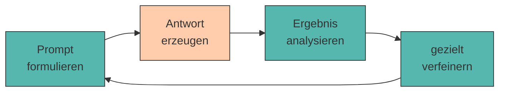

# 4. Iteratives Prompt Engineering

Der erste Prompt ist selten der beste. Gute Ergebnisse entstehen meist **schrittweise** – durch gezieltes Verbessern, Analysieren und Verfeinern.

Das ist keine Schwäche der Methode, sondern ihr Wesen. Auch erfahrene Prompt Engineers schreiben selten den perfekten Prompt beim ersten Versuch. Der Unterschied: Sie verbessern **systematisch** statt zufällig.

---

## Der Zyklus



!!! warning "Die häufigste Anti-Methode"

    Prompt schreiben → Ergebnis gefällt nicht → **alles neu schreiben** → Ergebnis gefällt immer noch nicht → wieder alles neu.

    Das Problem: Du weißt am Ende nicht, **welche** Änderung was bewirkt hat. Du drehst an fünf Schrauben gleichzeitig und wunderst dich über das Ergebnis.

    👉 Ändere pro Iteration **genau eine Sache**.

---

## Output analysieren

Bevor du etwas änderst, benenne **präzise**, was nicht stimmt. Die meisten Probleme fallen in eine dieser fünf Kategorien:

<div style="text-align:center; max-width:780px; margin:16px auto;">
<table role="table"
       style="width:100%; border-collapse:separate; border-spacing:0; border:1px solid #cfd8e3; border-radius:10px; overflow:hidden; font-family:system-ui,sans-serif;">
    <thead>
    <tr style="background:#009485; color:#fff;">
        <th style="text-align:left; padding:12px 14px; font-weight:700;">Symptom</th>
        <th style="text-align:left; padding:12px 14px; font-weight:700;">Wahrscheinliche Ursache</th>
        <th style="text-align:left; padding:12px 14px; font-weight:700;">Gegenmittel</th>
    </tr>
    </thead>
    <tbody>
    <tr>
        <td style="background:#00948511; padding:10px 14px; font-weight:600;">Zu allgemein</td>
        <td style="padding:10px 14px;">Kontext fehlt</td>
        <td style="padding:10px 14px;">Situation, Zielgruppe, Zahlen ergänzen</td>
    </tr>
    <tr>
        <td style="background:#00948511; padding:10px 14px; font-weight:600;">Falsches Format</td>
        <td style="padding:10px 14px;">Format nicht vorgemacht</td>
        <td style="padding:10px 14px;">Muster vorgeben oder <a href="shot-prompting.md">Few-Shot</a></td>
    </tr>
    <tr>
        <td style="background:#00948511; padding:10px 14px; font-weight:600;">Zu lang / zu kurz</td>
        <td style="padding:10px 14px;">keine Umfangsvorgabe</td>
        <td style="padding:10px 14px;">„genau 5 Punkte", <code>num_predict</code></td>
    </tr>
    <tr>
        <td style="background:#00948511; padding:10px 14px; font-weight:600;">Erfundene Fakten</td>
        <td style="padding:10px 14px;">Wissenslücke wird gefüllt</td>
        <td style="padding:10px 14px;">Quellen mitgeben, <code>[UNBEKANNT]</code> erlauben</td>
    </tr>
    <tr>
        <td style="background:#00948511; padding:10px 14px; font-weight:600;">Thema verfehlt</td>
        <td style="padding:10px 14px;">Aufgabe mehrdeutig</td>
        <td style="padding:10px 14px;">Verb schärfen, Aufgabe zerlegen</td>
    </tr>
    </tbody>
</table>
</div>

---

## Verfeinerungsstrategien

???+ process "Fünf Werkzeuge für die nächste Iteration"

    1. **Hinzufügen** – der fehlende [Baustein](anatomie.md) (meist Kontext oder Format).
    2. **Verschärfen** – vage Verben durch präzise ersetzen: *analysieren* → *drei Risiken nennen und je einen Satz begründen*.
    3. **Zerlegen** – ein Prompt macht zu viel auf einmal → in zwei Prompts aufteilen ([Chaining](chaining.md)).
    4. **Vormachen** – statt zu beschreiben, ein Beispiel liefern ([Few-Shot](shot-prompting.md)).
    5. **Weglassen** – überflüssige Höflichkeitsfloskeln und Wiederholungen streichen. Bei kleinen Modellen verwässert Ballast die eigentliche Anweisung.

!!! tip "Das Modell als Prompt-Kritiker"

    Du kannst die KI ihre eigene Antwort bewerten lassen:

    > *„Hier ist mein Prompt und die Antwort. Welche Information fehlte dir, um eine bessere Antwort zu geben? Nenne genau drei Punkte."*

    Bei kleinen Modellen ist das Ergebnis mit Vorsicht zu genießen – aber es liefert oft überraschend brauchbare Hinweise auf fehlenden Kontext.

---

## Dokumentieren: das Prompt-Logbuch

Ohne Protokoll verlierst du nach der dritten Iteration den Überblick. Halte für jede Runde fest: **was geändert – was bewirkt**.

```markdown title="prompt_log.md"
## Iteration 1 – Baseline
Prompt: "Erstelle ein Business Model Canvas für meinen Bio-Lieferdienst."
Ergebnis: 4 von 9 Feldern, sehr allgemein, teilweise Englisch.
Problem: Modell kennt die 9 Felder nicht sicher.

## Iteration 2 – Felder explizit vorgeben
Änderung: alle 9 Feldnamen im Prompt aufgelistet.
Ergebnis: 9 von 9 Feldern ✅, Inhalt aber noch generisch.
Problem: fehlender Kontext.

## Iteration 3 – Kontext ergänzt
Änderung: Standort, Zielgruppe, Startkapital hinzugefügt.
Ergebnis: konkret und brauchbar. ⭐ Bester Prompt bisher.
```

---

## 🔬 Ollama-Labor

!!! example "Übung 1: Eine Schraube pro Runde"

    Verbessere einen bewusst schlechten Prompt in vier Iterationen – jeweils mit **genau einer** Änderung.

    ```python title="iterationen.py"
    from llm import frage

    iterationen = [
        # Runde 1: Baseline
        "Mach ein Business Model Canvas für einen Bio-Lieferdienst.",

        # Runde 2: + explizite Felder
        """Erstelle ein Business Model Canvas für einen Bio-Lieferdienst.
    Fülle genau diese 9 Felder aus: Kundensegmente, Wertangebot, Kanäle,
    Kundenbeziehungen, Einnahmequellen, Schlüsselressourcen,
    Schlüsselaktivitäten, Schlüsselpartner, Kostenstruktur.""",

        # Runde 3: + Kontext
        """Erstelle ein Business Model Canvas.

    KONTEXT: Zwei-Personen-Startup in Innsbruck, Lieferdienst für regionale
    Bio-Lebensmittel, 15.000 € Startkapital, Zielgruppe berufstätige Familien.

    Fülle genau diese 9 Felder aus: Kundensegmente, Wertangebot, Kanäle,
    Kundenbeziehungen, Einnahmequellen, Schlüsselressourcen,
    Schlüsselaktivitäten, Schlüsselpartner, Kostenstruktur.""",

        # Runde 4: + Format & Umfang
        """Erstelle ein Business Model Canvas.

    KONTEXT: Zwei-Personen-Startup in Innsbruck, Lieferdienst für regionale
    Bio-Lebensmittel, 15.000 € Startkapital, Zielgruppe berufstätige Familien.

    FORMAT: Eine Zeile pro Feld, exakt so:
    <Feldname>: <maximal 15 Wörter>

    Felder: Kundensegmente, Wertangebot, Kanäle, Kundenbeziehungen,
    Einnahmequellen, Schlüsselressourcen, Schlüsselaktivitäten,
    Schlüsselpartner, Kostenstruktur.
    Antworte auf Deutsch. Keine Einleitung, keine Erklärung.""",
    ]

    FELDER = ["Kundensegmente", "Wertangebot", "Kanäle", "Kundenbeziehungen",
              "Einnahmequellen", "Schlüsselressourcen", "Schlüsselaktivitäten",
              "Schlüsselpartner", "Kostenstruktur"]

    for i, prompt in enumerate(iterationen, start=1):
        antwort = frage(prompt)
        gefunden = sum(1 for f in FELDER if f.lower() in antwort.lower())
        print(f"\n{'=' * 60}")
        print(f"ITERATION {i}  –  {gefunden}/9 Felder erkannt")
        print("=" * 60)
        print(antwort)
    ```

    **Beobachte:** Der Feldzähler ist deine erste **automatische Metrik**. Zwischen welchen beiden Runden springt er am stärksten?

!!! example "Übung 2: Das Modell kritisiert sich selbst"

    ```python title="selbstkritik.py"
    from llm import frage

    prompt = "Beschreibe meine Geschäftsidee."
    antwort = frage(prompt)

    kritik = frage(f"""Ein Nutzer hat diesen Prompt geschrieben:
    ---
    {prompt}
    ---
    Und diese Antwort erhalten:
    ---
    {antwort}
    ---
    Welche drei Informationen hätte der Nutzer mitliefern müssen, damit die
    Antwort konkret und nützlich wird? Antworte als nummerierte Liste,
    ein Satz pro Punkt, auf Deutsch.""")

    print(kritik)
    ```

    Sind die Vorschläge brauchbar? Teste dieselbe Selbstkritik zusätzlich mit `llama3.2:1b` – wie groß ist der Unterschied?

??? question "Übung 3: Automatischer Prompt-Vergleich (Python)"

    Baue ein Mini-Testsystem, das Prompts anhand messbarer Kriterien bewertet.

    ```python title="bewerter.py"
    from llm import frage

    def bewerte(antwort, pflichtbegriffe, max_woerter):
        """Gibt einen Score von 0 bis 100 zurück."""
        # TODO 1: Anteil der gefundenen Pflichtbegriffe berechnen (0.0–1.0)
        # TODO 2: Längen-Score: 1.0 wenn <= max_woerter, sonst anteilig weniger
        # TODO 3: beide Teilscores kombinieren und auf 0–100 skalieren
        ...

    # Beispielaufruf
    a = frage("Nenne 3 Risiken für einen Bio-Lieferdienst. Maximal 60 Wörter.")
    print(bewerte(a, ["risiko", "kosten", "konkurrenz"], max_woerter=60))
    ```

    ??? success "Lösungsvorschlag"

        ```python title="bewerter.py"
        def bewerte(antwort, pflichtbegriffe, max_woerter):
            text = antwort.lower()

            # 1) Inhalt: wie viele Pflichtbegriffe kommen vor?
            treffer = sum(1 for b in pflichtbegriffe if b.lower() in text)
            inhalt = treffer / len(pflichtbegriffe)

            # 2) Länge: Überlänge wird proportional bestraft
            woerter = len(antwort.split())
            laenge = 1.0 if woerter <= max_woerter else max_woerter / woerter

            # 3) Gewichtet kombinieren – Inhalt zählt doppelt
            score = (inhalt * 2 + laenge) / 3 * 100

            print(f"Begriffe: {treffer}/{len(pflichtbegriffe)} · "
                  f"Wörter: {woerter}/{max_woerter} · Score: {score:.0f}")
            return round(score)
        ```

        **Warum das nützlich ist:** Sobald du eine Zahl hast, kannst du Prompts **objektiv** vergleichen, statt sie nach Bauchgefühl zu beurteilen. Genau dieses Prinzip steckt hinter professionellen Prompt-Evaluationen – mehr dazu in [Evaluation von KI-Ergebnissen](evaluation.md).

---

???+ question "Selbsttest"

    1. Warum solltest du pro Iteration nur eine Änderung vornehmen?
    2. Die Antwort ist inhaltlich gut, aber viel zu lang. Welche Verfeinerungsstrategie greift?
    3. Wozu dient ein Prompt-Logbuch?

    ??? success "Lösungsskizze"

        1. Weil du sonst nicht zuordnen kannst, welche Änderung die Wirkung erzeugt hat – und beim nächsten Mal wieder bei null anfängst.
        2. **Verschärfen** durch eine Umfangsvorgabe („genau 5 Stichpunkte", „maximal 80 Wörter") – technisch flankiert durch `num_predict`.
        3. Es macht den Verbesserungsweg nachvollziehbar, verhindert Kreisläufe und liefert dir am Ende die begründete Version für deine [Prompt Library](libraries.md).

---

!!! example "Lab"

    **Mehrere Iterationen eines Canvas erstellen**

    Verbessere dein Business Model Canvas über mehrere Iterationen hinweg. Dokumentiere bei jedem Schritt, welche Änderung am Prompt welche Wirkung auf das Ergebnis hatte.

    **Konkrete Schritte:**

    1. Starte mit deinem Canvas-Prompt aus [Kapitel 3](shot-prompting.md).
    2. Führe **mindestens vier Iterationen** durch – pro Runde genau eine Änderung.
    3. Führe ein `prompt_log.md` nach dem Muster oben.
    4. Miss den Fortschritt mit dem Feldzähler aus Übung 1.
    5. Speichere die beste Version als `prompts/02_canvas.md` (ersetzt die Version aus Kapitel 3).

---

## Quellen

!!! info "Literatur"

    - **Zuckarelli, J. (2025):** *Programmieren mit ChatGPT*. Springer Nature. [https://doi.org/10.1007/978-3-662-69433-6](https://doi.org/10.1007/978-3-662-69433-6)
    - **Anthropic (2025):** *Prompt engineering overview.* [https://docs.anthropic.com/en/docs/build-with-claude/prompt-engineering/overview](https://docs.anthropic.com/en/docs/build-with-claude/prompt-engineering/overview)

    Zur Ausarbeitung wurden generative Tools unterstützend eingesetzt.
