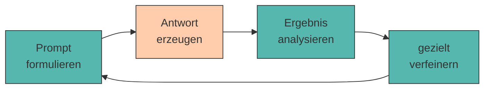

# Iterative Prompting

Der erste Prompt ist selten der beste. Gute Ergebnisse entstehen meist **schrittweise** - durch gezieltes Verbessern, Analysieren und Verfeinern.

Das ist keine Schwäche der Methode, sondern ihr Wesen. Auch erfahrene Prompt Engineers schreiben selten den perfekten Prompt beim ersten Versuch. Der Unterschied: Sie verbessern **systematisch** statt zufällig.

Wie ernst das gemeint ist, zeigt ein Blick in die Forschung: Es gibt inzwischen Verfahren, die das Iterieren **automatisieren** - Pryzant et al. lassen ein Modell aus fehlerhaften Antworten in natürlicher Sprache formulierte „Gradienten" ableiten und daraus die nächste Prompt-Version bauen.[^pryzant] Zhou et al. gehen noch weiter und lassen Sprachmodelle Prompts vollständig selbst erzeugen und auswählen - mit Ergebnissen auf dem Niveau menschlicher Prompt Engineers.[^zhou] Beide Ansätze bestätigen dasselbe Prinzip, das du in diesem Kapitel von Hand lernst: **erzeugen, bewerten, gezielt ändern, wiederholen.**

---

## Der Zyklus



Der Ablauf des Iterativen Prompting könnte nicht einfacher sein: Man formuliert einen Prompt, lässt das Modell eine Antwort erzeugen, analysiert die Antwort, verfeinert den Prompt und startet von vorn.
Dabei ist es wichtig, dass man pro Iteration **genau eine Sache** ändert. Würde man alles gleichzeitig ändern, wüsste man am Ende nicht, welche Änderung was bewirkt hat.

???+ defi "Wie Menschen prompten"

    Zamfirescu-Pereira et al.[^johnny] haben untersucht, wie Menschen ohne KI-Hintergrund tatsächlich prompten. Drei Muster traten regelmäßig auf:

    - **Opportunistisches Ausprobieren** statt systematischem Vorgehen - man ändert, was gerade auffällt.
    - **Übergeneralisierung aus Einzelfällen**: Ein einziger guter Durchlauf gilt als Beweis, dass der Prompt funktioniert.
    - **Vermenschlichung**: Man erklärt dem Modell die Aufgabe so, wie man sie einem Menschen erklären würde - inklusive Andeutungen, die es nicht auflösen kann.

    Das zweite Muster ist besonders tückisch, weil Sprachmodelle [nicht deterministisch](ollama-setup.md) sind: Bei jedem Wort wird aus einer Wahrscheinlichkeitsverteilung **gezogen**, nicht einfach das wahrscheinlichste Wort genommen - genau darauf beruhen die gängigen Sampling-Verfahren.[^holtzman] Zwei Durchläufe desselben Prompts sind damit zwei verschiedene Stichproben.

---

## Eine Iteration im Detail

Nun packen wir die Theorie beiseite - so sieht eine Runde in der Praxis aus. Wir bleiben beim Business Model Canvas.

**Runde 1 - die Baseline:**

```{.text .ollama title="Ollama Chat"}
Erstelle ein Business Model Canvas für meinen Bio-Lieferdienst.
```

```{.text .no-copy title="Beispielausgabe (gekürzt)"}
Ein Business Model Canvas für einen Bio-Lieferdienst könnte so aussehen:

Kundensegmente: Menschen, die Wert auf gesunde Ernährung legen.
Wertangebot: Frische Bio-Produkte, bequem geliefert.
Kanäle: Website und App.

Ich hoffe, das hilft dir weiter! Sag Bescheid, wenn du mehr Details brauchst.
```

Jetzt kommt der entscheidende Schritt - **benennen, was fehlt**, statt nur „gefällt mir nicht" zu denken und meist auch zu schreiben:

- Von neun Feldern kommen **drei**. Das Modell kennt die Struktur offenbar nicht sicher.
- Der Inhalt passt auf *jeden* Bio-Lieferdienst - es fehlt der Kontext.
- Am Ende steht eine Floskel, die niemand bestellt hat.

Drei Probleme, drei mögliche Änderungen. Und genau hier wird die Regel wichtig: **nur eine davon pro Runde.** Wir beginnen mit der gravierendsten - der fehlenden Struktur.

**Runde 2 - die neun Felder explizit vorgeben:**

```{.text .ollama title="Ollama Chat"}
"""
...Erstelle ein Business Model Canvas für meinen Bio-Lieferdienst.
...Verwende genau diese neun Felder, je ein Stichpunkt pro Feld:
...Kundensegmente, Wertangebot, Kanäle, Kundenbeziehungen, Einnahmequellen,
...Schlüsselressourcen, Schlüsselaktivitäten, Schlüsselpartner, Kostenstruktur.
..."""
```

Ergebnis: neun von neun Feldern. Der Inhalt ist immer noch generisch - aber das ist jetzt ein **anderes** Problem, das die nächste Runde löst. Genau so entsteht der Fortschritt: ein Symptom nach dem anderen.

---

## Output analysieren

Bevor du etwas änderst, benenne **präzise**, was nicht stimmt. Die meisten Probleme fallen in eine dieser fünf Kategorien:

<div style="text-align:center; max-width:780px; margin:16px auto;">
<table role="table"
       style="width:100%; border-collapse:separate; border-spacing:0; border:1px solid #cfd8e3; border-radius:10px; overflow:hidden; font-family:system-ui,sans-serif;">
    <thead>
    <tr style="background:#009485; color:#fff;">
        <th style="text-align:left; padding:12px 14px; font-weight:700;">Symptom</th>
        <th style="text-align:left; padding:12px 14px; font-weight:700;">Wahrscheinliche Ursache</th>
        <th style="text-align:left; padding:12px 14px; font-weight:700;">Gegenmittel</th>
    </tr>
    </thead>
    <tbody>
    <tr>
        <td style="background:#00948511; padding:10px 14px; font-weight:600;">Zu allgemein</td>
        <td style="padding:10px 14px;">Kontext fehlt</td>
        <td style="padding:10px 14px;">Situation, Zielgruppe, Zahlen ergänzen</td>
    </tr>
    <tr>
        <td style="background:#00948511; padding:10px 14px; font-weight:600;">Falsches Format</td>
        <td style="padding:10px 14px;">Format nicht vorgemacht</td>
        <td style="padding:10px 14px;">Muster vorgeben oder <a href="shot-prompting.md">Few-Shot</a></td>
    </tr>
    <tr>
        <td style="background:#00948511; padding:10px 14px; font-weight:600;">Zu lang / zu kurz</td>
        <td style="padding:10px 14px;">keine Umfangsvorgabe</td>
        <td style="padding:10px 14px;">„genau 5 Punkte", <code>num_predict</code></td>
    </tr>
    <tr>
        <td style="background:#00948511; padding:10px 14px; font-weight:600;">Erfundene Fakten</td>
        <td style="padding:10px 14px;">Wissenslücke wird gefüllt</td>
        <td style="padding:10px 14px;">Quellen mitgeben, <code>[UNBEKANNT]</code> erlauben</td>
    </tr>
    <tr>
        <td style="background:#00948511; padding:10px 14px; font-weight:600;">Thema verfehlt</td>
        <td style="padding:10px 14px;">Aufgabe mehrdeutig</td>
        <td style="padding:10px 14px;">Verb schärfen, Aufgabe zerlegen</td>
    </tr>
    </tbody>
</table>
</div>

---

## Verfeinerungsstrategien

???+ process "Fünf Werkzeuge für die nächste Iteration"

    1. **Hinzufügen** - der fehlende [Baustein](anatomie.md) (meist Kontext oder Format).
    2. **Verschärfen** - vage Verben durch präzise ersetzen: *analysieren* → *drei Risiken nennen und je einen Satz begründen*.
    3. **Zerlegen** - ein Prompt macht zu viel auf einmal → in zwei Prompts aufteilen ([Chaining](chaining.md)).
    4. **Vormachen** - statt zu beschreiben, ein Beispiel liefern ([Few-Shot](shot-prompting.md)).
    5. **Weglassen** - überflüssige Höflichkeitsfloskeln und Wiederholungen streichen. Bei kleinen Modellen verwässert Ballast die eigentliche Anweisung.

    Diese fünf Werkzeuge sind keine Erfindung dieses Kurses: Sie sind die praktische Kurzfassung dessen, was Übersichtsarbeiten zum Prompt Engineering als wiederkehrende Stellschrauben beschreiben.[^sahoo] [^liu2021]

!!! tip "Das Modell als Prompt-Kritiker"

    Du kannst die KI ihre eigene Antwort bewerten lassen:

    ```{.text .ollama title="Ollama Chat"}
    Welche Information fehlte dir, um eine bessere Antwort zu geben?
    ...Nenne genau drei Punkte.
    ```

    Dieses Prinzip - erzeugen, selbst kritisieren, überarbeiten - ist als *Self-Refine* untersucht worden: Madaan et al. berichten über verschiedene Aufgaben hinweg spürbare Verbesserungen allein durch diese Schleife, ganz ohne zusätzliches Training.[^madaan]

    **Aber Vorsicht, die Forschung ist sich uneinig.** Huang et al. haben nachgeprüft, ob Modelle ihre eigenen Fehler wirklich erkennen - und kommen bei Reasoning-Aufgaben zum gegenteiligen Ergebnis: Ohne Rückmeldung von außen verschlechtern sich die Antworten durch Selbstkorrektur eher, als dass sie besser werden.[^huang] Der Grund ist einleuchtend: Wer einen Fehler nicht bemerkt hat, bemerkt ihn beim zweiten Hinsehen meist auch nicht.

    <div style="text-align: center;">
        
        <figcaption>Wer die eigene Schwäche nicht erkennt, kann sie auch nicht beheben - bei Menschen wie bei Modellen. (Quelle: <a href="https://i.pinimg.com/736x/5a/13/98/5a1398fd5e6535008af5856e20a95486.jpg" target="_blank" rel="noopener">Pinterest</a>)</figcaption>
    </div>

    Für dich heißt das: Nutze die Selbstkritik, um **fehlenden Kontext aufzuspüren** - dafür funktioniert sie erfahrungsgemäß gut. Verlass dich aber nicht darauf, dass das Modell inhaltliche Fehler in seiner eigenen Antwort findet. Diese Rolle behältst du.

---

## 🔬 Ollama-Lab

Alles ab hier drehst du an **deiner eigenen Geschäftsidee**. Die Beispiele oben im Kapitel zeigen das Verfahren - hier wendest du es an. Terminal auf, `ollama run gemma3:1b`, los.

!!! lab "Übung 1: Eine Schraube pro Runde"

    Nimm deinen Canvas-Prompt aus [Shot Prompting](shot-prompting.md) (`## 02a` in deinem `lab_log.md`) und verbessere ihn in **mindestens vier Runden** - pro Runde **genau eine** Änderung.

    Naheliegende Reihenfolge:

    1. Baseline - was du jetzt hast
    2. + die neun Feldnamen explizit auflisten
    3. + Kontext aus deiner `idee.md`
    4. + Format und Umfang je Feld

    **Deine Messgröße:** Wie viele der neun Felder kommen tatsächlich vor? Zähle nach jeder Runde.

    Protokolliere jede Runde im `lab_log.md` unter `## 02b` nach dem Muster oben - *was geändert, was bewirkt*.

    ??? success "Was du beobachten solltest"

        Runde 2 ist meist der große Sprung: Sobald die neun Feldnamen wörtlich im Prompt stehen, kommen sie auch in der Antwort - oft von 5/9 auf 9/9.

        Runde 3 und 4 ändern an der **Zahl** dagegen nichts mehr. Die Antwort wird trotzdem besser: konkreter, auf deine Idee bezogen, gleichmäßig ausführlich. Genau dieser Widerspruch ist das Thema von Übung 3 - achte schon jetzt darauf.

!!! lab "Übung 2: Das Modell als Prompt-Kritiker"

    Nimm deinen **schwächsten** Prompt und frage im selben Chat direkt nach:

    ```{.text .ollama title="Ollama Chat"}
    Welche drei Informationen hätte ich dir mitliefern müssen, damit deine Antwort konkret und nützlich wird?
    ```

    **Prüfe:** Sind die Vorschläge brauchbar? Und decken sie sich mit den [fünf Bausteinen](anatomie.md)?

    ??? success "Was du beobachten solltest - und der Haken daran"

        Die Vorschläge sind meist erstaunlich brauchbar und landen fast immer bei Kontext, Zielgruppe und Format - also bei den Bausteinen 2 bis 5.

        Der Haken: Du fragst hier ausgerechnet **die Selbsteinschätzung** des Modells ab. Wie wenig die im Allgemeinen wert ist, weist du in [Evaluation von KI-Ergebnissen](evaluation.md) selbst nach - dort hält das Modell Aussagen für belegt, die frei erfunden sind.

        Warum es hier trotzdem funktioniert: Nach *fehlendem Kontext* zu fragen ist eine **Sprachaufgabe** („was fehlt einem Text dieser Art?"), keine Faktenfrage. Genau dafür sind LLMs gebaut. Nimm die Antworten als Ideenliste - nicht als Diagnose.

!!! lab "Übung 3: Wo hört es auf?"

    Iteriere weiter, bis sich nichts mehr verbessert. Halte fest:

    - Nach welcher Runde brachte eine Änderung **keinen** Zuwachs mehr?
    - **Gab es eine Runde, in der die Feldzahl gleich blieb, die Antwort aber merklich besser wurde?** Was sagt das über deine Messgröße aus?
    - **Sabotage-Runde:** Überlade einen Prompt absichtlich - drei Rollen gleichzeitig, fünf Formatvorgaben, widersprüchliche Längenangaben. Was passiert mit deiner Zahl, was mit der Antwort?

    Speichere die beste Version im `lab_log.md` unter `## 02b Canvas (iteriert)`. **Lass `## 02a` stehen** - am Ende des Kurses willst du den Weg sehen, nicht nur das Ziel.

    ??? success "Was du beobachten solltest"

        Die Feldzahl erreicht typischerweise ab Runde 2 ihr Maximum und bleibt dort - obwohl Runde 3 und 4 inhaltlich deutlich stärker sind. **Deine Metrik ist blind für genau die Verbesserung, an der dir am meisten liegt.**

        Das ist keine Anfängerfalle, sondern ein offenes Forschungsproblem: Wie sich die Qualität von Sprachmodell-Ausgaben überhaupt sinnvoll messen lässt, füllt ganze Übersichtsarbeiten - mit dem Fazit, dass automatische Metriken menschliche Bewertung ergänzen, aber nicht ersetzen.[^chang]

        👉 Merke: **Eine Metrik misst nur, was sie misst.** Sie sagt dir, *wo* du hinschauen sollst - das Hinschauen nimmt sie dir nicht ab.

        Die Sabotage-Runde zeigt die andere Richtung: Widersprüchliche Vorgaben lassen das Modell meist die *zuletzt* genannte befolgen und den Rest ignorieren. Mehr Anweisung ist nicht mehr Steuerung.

??? code "🐍 Optional (Python): Prompts automatisch bewerten"

    Sobald du eine **Zahl** hast, kannst du Prompts objektiv vergleichen, statt nach Bauchgefühl zu urteilen. Genau dieses Prinzip steckt hinter professionellen Prompt-Evaluationen.

    ```python title="bewerter.py"
    from llm import frage

    FELDER = ["Kundensegmente", "Wertangebot", "Kanäle", "Kundenbeziehungen",
              "Einnahmequellen", "Schlüsselressourcen", "Schlüsselaktivitäten",
              "Schlüsselpartner", "Kostenstruktur"]


    ITERATIONEN = [
        "Erstelle ein Business Model Canvas für meinen Bio-Lieferdienst.",
        "Erstelle ein Business Model Canvas für meinen Bio-Lieferdienst. "
        "Verwende genau diese neun Felder: " + ", ".join(FELDER) + ".",
        # ... hier deine weiteren Runden ergänzen
    ]


    def bewerte(antwort, pflichtbegriffe=FELDER, max_woerter=200):
        text = antwort.lower()

        # 1) Inhalt: wie viele Pflichtbegriffe kommen vor?
        treffer = sum(1 for b in pflichtbegriffe if b.lower() in text)
        inhalt = treffer / len(pflichtbegriffe)

        # 2) Länge: Überlänge wird proportional bestraft
        woerter = len(antwort.split())
        laenge = 1.0 if woerter <= max_woerter else max_woerter / woerter

        # 3) Gewichtet kombinieren - Inhalt zählt doppelt
        score = (inhalt * 2 + laenge) / 3 * 100

        print(f"Felder: {treffer}/{len(pflichtbegriffe)} · "
              f"Wörter: {woerter}/{max_woerter} · Score: {score:.0f}")
        return round(score)


    for runde, prompt in enumerate(ITERATIONEN, start=1):
        print(f"\nRunde {runde}:", end=" ")
        bewerte(frage(prompt))
    ```

    ```title="Ausgabe"
    Runde 1: Felder: 3/9 · Wörter: 61/200 · Score: 56
    Runde 2: Felder: 9/9 · Wörter: 128/200 · Score: 100
    Runde 3: Felder: 9/9 · Wörter: 141/200 · Score: 100
    Runde 4: Felder: 9/9 · Wörter: 97/200 · Score: 100
    ```

    **Die Zahl bestätigt, was du in Übung 3 von Hand gesehen hast:** Ab Runde 2 steht der Score bei 100, obwohl Runde 3 inhaltlich deutlich besser ist. Das Skript automatisiert die Messung - die Blindheit der Messgröße automatisiert es gleich mit.

    Genau deshalb lohnt sich der Aufwand trotzdem: Ein Score macht **Regressionen** sichtbar. Wenn ein Prompt nach einer Änderung von 100 auf 78 fällt, weißt du es sofort, statt es zu überlesen.

---

## Quellen

Zur Ausarbeitung wurden generative Tools unterstützend eingesetzt.

[^johnny]: **Zamfirescu-Pereira, J. D., Wong, R. Y., Hartmann, B. & Yang, Q. (2023):** *Why Johnny Can't Prompt: How Non-AI Experts Try (and Fail) to Design LLM Prompts.* CHI '23, S. 1-21. [https://doi.org/10.1145/3544548.3581388](https://doi.org/10.1145/3544548.3581388) - die empirische Grundlage dieses Kapitels: Nicht-Fachleute iterieren meist **opportunistisch** statt systematisch, verallgemeinern aus Einzelfällen und verwerfen funktionierende Ansätze zu früh. Genau dagegen hilft „eine Änderung pro Runde" plus Logbuch.
[^madaan]: **Madaan, A., Tandon, N., Gupta, P. et al. (2023):** *Self-Refine: Iterative Refinement with Self-Feedback.* arXiv:2303.17651. [https://arxiv.org/abs/2303.17651](https://arxiv.org/abs/2303.17651) - zeigt, dass ein Modell seine eigene Ausgabe kritisieren und daraufhin verbessern kann - die Grundlage von Übung 2. Wichtig: Der Effekt ist bei **kleinen** Modellen deutlich schwächer.
[^huang]: **Huang, J., Chen, X., Mishra, S. et al. (2024):** *Large Language Models Cannot Self-Correct Reasoning Yet.* ICLR 2024. arXiv:2310.01798. [https://arxiv.org/abs/2310.01798](https://arxiv.org/abs/2310.01798) - die Gegenposition zu *Self-Refine*: Ohne externe Rückmeldung verschlechtert Selbstkorrektur die Ergebnisse bei Reasoning-Aufgaben eher, als sie zu verbessern. Deshalb im Kapitel die Einschränkung auf „fehlenden Kontext aufspüren".
[^pryzant]: **Pryzant, R., Iter, D., Li, J. et al. (2023):** *Automatic Prompt Optimization with „Gradient Descent" and Beam Search.* EMNLP 2023. arXiv:2305.03495. [https://arxiv.org/abs/2305.03495](https://arxiv.org/abs/2305.03495) - automatisiert genau den Zyklus dieses Kapitels: Fehler analysieren, in Sprache formulierte „Gradienten" ableiten, Prompt gezielt ändern.
[^zhou]: **Zhou, Y., Muresanu, A. I., Han, Z. et al. (2023):** *Large Language Models Are Human-Level Prompt Engineers.* ICLR 2023. arXiv:2211.01910. [https://arxiv.org/abs/2211.01910](https://arxiv.org/abs/2211.01910) - Modelle erzeugen und bewerten Prompts selbst und erreichen dabei menschliches Niveau. Zeigt, wie systematisierbar das Iterieren ist.
[^holtzman]: **Holtzman, A., Buys, J., Du, L. et al. (2020):** *The Curious Case of Neural Text Degeneration.* ICLR 2020. arXiv:1904.09751. [https://arxiv.org/abs/1904.09751](https://arxiv.org/abs/1904.09751) - Grundlagenarbeit zu den Sampling-Verfahren, aus denen die Nichtdeterminiertheit folgt: Der Text wird gezogen, nicht berechnet. Deshalb muss jede Variante mehrfach laufen.
[^chang]: **Chang, Y., Wang, X., Wang, J. et al. (2024):** *A Survey on Evaluation of Large Language Models.* ACM Transactions on Intelligent Systems and Technology 15(3), S. 1-45. arXiv:2307.03109. [https://arxiv.org/abs/2307.03109](https://arxiv.org/abs/2307.03109) - Überblick über Bewertungsverfahren und ihre Grenzen; Hintergrund für die Warnung, dass eine Metrik das Lesen nicht ersetzt.
[^sahoo]: **Sahoo, P., Singh, A. K., Saha, S. et al. (2024):** *A Systematic Survey of Prompt Engineering in Large Language Models: Techniques and Applications.* arXiv:2402.07927. [https://arxiv.org/abs/2402.07927](https://arxiv.org/abs/2402.07927) - Systematik der gängigen Prompting-Techniken; Grundlage für die fünf Verfeinerungswerkzeuge.
[^liu2021]: **Liu, P., Yuan, W., Fu, J. et al. (2023):** *Pre-train, Prompt, and Predict: A Systematic Survey of Prompting Methods in Natural Language Processing.* ACM Computing Surveys 55(9), S. 1-35. arXiv:2107.13586. [https://arxiv.org/abs/2107.13586](https://arxiv.org/abs/2107.13586) - die erste große Systematisierung des Feldes; ordnet Prompt-Entwurf als eigenständigen Arbeitsschritt ein.
