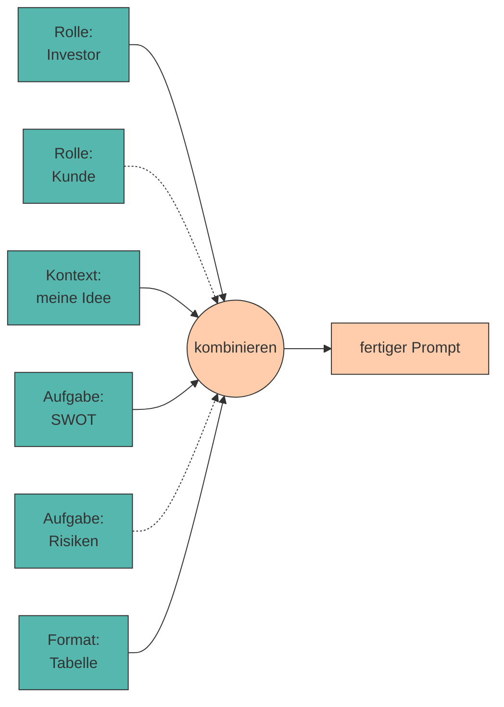

# 11. Prompt Libraries und Wiederverwendung

Bewährte Prompts müssen nicht jedes Mal neu erfunden werden. **Prompt Libraries** sammeln, strukturieren und standardisieren erprobte Prompts für den wiederholten Einsatz – besonders wertvoll im Unternehmenskontext.

Damit schließt sich der Kreis: Du hast durch den ganzen Kurs Prompts entwickelt und verbessert. Jetzt machst du daraus ein **Werkzeug**, das dich über den Kurs hinaus begleitet.

---

## Warum sich das lohnt

!!! quote "Merksatz"

    Ein guter Prompt ist kein Wegwerfprodukt. Er ist **Arbeitsergebnis** – so wie eine Excel-Vorlage oder ein Codebaustein.[^white]

<div class="grid cards" markdown>

- :material-clock-fast: **Zeit**

    ---

    Ein erprobter Prompt spart die drei bis fünf [Iterationen](iteratives.md), die du beim ersten Mal gebraucht hast.

- :material-equal: **Konsistenz**

    ---

    Zehn Personen im Team erzeugen mit demselben Prompt vergleichbare Ergebnisse – statt zehn unterschiedliche.

- :material-trending-up: **Qualität**

    ---

    Verbesserungen kommen allen zugute. Der Prompt wird über die Zeit besser, nicht jedes Mal neu erfunden.

- :material-school: **Wissenstransfer**

    ---

    Neue Teammitglieder starten mit dem gesammelten Erfahrungswissen statt bei null.

</div>

---

## Modularisierung

Zerlege deine Prompts in **wiederverwendbare Bausteine** – im Grunde die fünf Elemente aus [Kapitel 2](anatomie.md), jetzt als getrennte Textblöcke:



Vier Rollen × drei Aufgaben × zwei Formate ergeben **24 Prompts** aus neun Bausteinen. Das ist der eigentliche Gewinn der Modularisierung.[^schulhoff]

---

## Templates mit Platzhaltern

Ein **Template** ist ein Prompt, in dem die veränderlichen Teile durch Platzhalter ersetzt sind:

```markdown title="templates/swot.md"
---
name: swot-analyse
version: 2
getestet_mit: qwen2.5:0.5b, llama3.2:1b
autor: M. Mustermann
---

Du bist {rolle} mit {erfahrung} Jahren Erfahrung in {branche}.

KONTEXT:
{kontext}

AUFGABE:
Erstelle eine SWOT-Analyse. Genau {anzahl} Punkte pro Kategorie.

FORMAT:
STÄRKEN: ...
SCHWÄCHEN: ...
CHANCEN: ...
RISIKEN: ...

Antworte auf Deutsch. Keine Einleitung.
```

???+ tip "Was in die Metadaten gehört"

    Der Block zwischen den `---` ist wertvoller, als er aussieht:

    - **`version`** – damit du Verbesserungen nachvollziehen kannst
    - **`getestet_mit`** – ein Prompt, der auf GPT-5 funktioniert, kann auf `qwen2.5:0.5b` scheitern. Diese Angabe verhindert falsche Erwartungen.
    - **`autor`** – wer weiß, warum der Prompt so formuliert ist

---

## Skills: die nächste Stufe

???+ defi "Skill"

    Ein **Skill** ist ein Paket aus Anweisung, Beispielen und optional Hilfsdateien oder Code, das ein KI-System bei Bedarf **selbstständig lädt** – ohne dass du es jedes Mal in den Prompt kopierst.

    Der Unterschied zum Template:

    | | Template | Skill |
    |---|---|---|
    | Aufruf | du kopierst es hinein | das System lädt es bei Bedarf |
    | Umfang | ein Textblock | Anweisung + Beispiele + Dateien |
    | Kontextfenster | immer voll belegt | nur belegt, wenn gebraucht |

Der Gedanke dahinter ist derselbe wie bei einer Funktionsbibliothek im Programmieren: **einmal sauber schreiben, überall verwenden**. Wenn dein Prompt-Ordner gut strukturiert ist, hast du bereits die Vorstufe davon gebaut.

---

## Im Unternehmen

???+ process "Von der privaten Sammlung zur Team-Bibliothek"

    1. **Sammeln** – jeder legt seine funktionierenden Prompts an einem gemeinsamen Ort ab.
    2. **Standardisieren** – einheitliche Struktur, Metadaten, Namensschema – am besten entlang echter Arbeitsaufgaben.[^sahoo]
    3. **Versionieren** – am besten in Git. Dann ist jede Änderung nachvollziehbar und rückgängig zu machen.
    4. **Testen** – für kritische Prompts ein paar feste Testfälle, wie in [Kapitel 4](iteratives.md).
    5. **Pflegen** – eine verantwortliche Person pro Bereich. Ohne Pflege veraltet eine Bibliothek schnell.

!!! warning "Vertraulichkeit"

    Prompts enthalten oft **Kontext** – Kundennamen, Zahlen, Strategien. Ein Prompt-Repository ist damit potenziell so sensibel wie eine Kundendatenbank.

    👉 Trenne **Template** (teilbar) von **Kontext** (vertraulich). Genau dafür sind Platzhalter da.

---

## 🔬 Ollama-Labor

!!! example "Übung 1: Ein Template ausfüllen"

    Deine Bibliothek ist zunächst nichts weiter als ein **Ordner mit Textdateien**. Lege an:

    ```title="Ordnerstruktur"
    prompt-labor/
    ├── idee.md
    ├── kritik.md
    └── templates/
        ├── swot.md
        ├── rollen-check.md
        └── faktencheck.md
    ```

    Speichere in `templates/swot.md` das Template von oben. Zum Ausfüllen brauchst du nur deinen Texteditor:

    1. Datei öffnen, Inhalt kopieren.
    2. **Suchen & Ersetzen** für jeden Platzhalter (`$rolle` → *Business Angel*, `$branche` → *der Lebensmittelbranche*, …).
    3. Fertigen Text zwischen `"""` in den Chat einfügen.

    ```title="Terminal"
    ollama run qwen2.5:0.5b

    >>> """
    ... Du bist Business Angel mit 15 Jahren Erfahrung in der Lebensmittelbranche.
    ...
    ... KONTEXT:
    ... Bio-Lieferdienst in Innsbruck, 2 Gründer, 15.000 € Startkapital.
    ...
    ... AUFGABE:
    ... Erstelle eine SWOT-Analyse. Genau 2 Punkte pro Kategorie.
    ...
    ... FORMAT:
    ... STÄRKEN: ...
    ... SCHWÄCHEN: ...
    ... CHANCEN: ...
    ... RISIKEN: ...
    ...
    ... Antworte auf Deutsch. Keine Einleitung.
    ... """
    ```

    ```title="Beispielausgabe"
    STÄRKEN: Direkter Draht zu regionalen Produzenten; glaubwürdiges
    Nachhaltigkeitsversprechen durch emissionsfreie Zustellung.
    SCHWÄCHEN: Sehr geringe Kapitaldecke; Abhängigkeit von zwei Personen.
    CHANCEN: Abo-Modell für planbare Umsätze; Kooperation mit Bauernmärkten.
    RISIKEN: Preisaktionen der Supermarktketten; Wetterabhängigkeit.
    ```

    **Deine Aufgabe:** Fülle dasselbe Template ein zweites Mal aus – mit `$rolle` = *„skeptischer Stammkunde"* und `$branche` = *„der Gastronomie"*. Wie stark ändert sich das Ergebnis, obwohl du **nur zwei Wörter** ausgetauscht hast?

!!! example "Übung 2: Der Härtetest 🧪"

    Ein Template ist erst dann wiederverwendbar, wenn es auch für eine **völlig andere** Idee funktioniert.

    Nimm dein `swot.md` und fülle es für eine Idee aus, die mit deiner nichts zu tun hat – zum Beispiel eine **Hundeschule** oder eine **mobile Fahrradwerkstatt**.

    ```title="Beispielausgabe für eine Hundeschule"
    STÄRKEN: Persönliche Betreuung in Kleingruppen; hohe Weiterempfehlungsrate
    in lokalen Hundehalter-Netzwerken.
    SCHWÄCHEN: Umsatz hängt direkt an der Arbeitszeit einer Person;
    saisonale Nachfrageschwankungen.
    ...
    ```

    **Deine Aufgabe:** Wenn du beim Ausfüllen an eine Stelle kommst, an der der Text nur zu deiner ursprünglichen Idee passt – **das ist ein Fehler im Template.** Ersetze diese Stelle durch einen neuen Platzhalter und notiere ihn.

    Genau so entstehen gute Templates: nicht durch Nachdenken, sondern durch Anwenden auf einen fremden Fall.

!!! example "Übung 3: Metadaten und Versionierung"

    Erweitere jedes deiner Templates um den Kopfblock:

    ```markdown title="templates/swot.md"
    ---
    name: swot-analyse
    version: 2
    getestet_mit: qwen2.5:0.5b, llama3.2:1b
    platzhalter: rolle, erfahrung, branche, kontext, anzahl
    autor: dein Name
    ---
    ```

    Die Zeile `platzhalter:` erspart dir späteres Suchen: Sobald du zehn Templates hast, weißt du nicht mehr auswendig, welches welche Werte braucht.

    **Deine Aufgabe:** Erhöhe die `version`, sobald du ein Template änderst, und notiere in einer Zeile darunter, *warum*. Nach drei Monaten wirst du dich für diese Zeile bedanken.

??? code "🐍 Optional (Python): die Bibliothek automatisieren"

    Suchen & Ersetzen von Hand funktioniert – aber bei zehn Templates und wechselnden Ideen wird es fehleranfällig. Diese Klasse lädt alle Templates aus einem Ordner und füllt sie aus:

    ```python title="prompt_library.py"
    from pathlib import Path
    from string import Template


    class PromptLibrary:
        def __init__(self, ordner="templates"):
            self.ordner = Path(ordner)
            self.templates = {d.stem: d.read_text(encoding="utf-8")
                              for d in self.ordner.glob("*.md")}
            print(f"📚 {len(self.templates)} Templates geladen: "
                  f"{', '.join(sorted(self.templates))}")

        def metadaten(self, name):
            """Liest den ---Block am Dateianfang als dict."""
            text = self.templates[name]
            if not text.startswith("---"):
                return {}
            _, block, _ = text.split("---", 2)
            return {z.split(":", 1)[0].strip(): z.split(":", 1)[1].strip()
                    for z in block.strip().splitlines() if ":" in z}

        def _koerper(self, name):
            """Template ohne Metadatenblock."""
            text = self.templates[name]
            return text.split("---", 2)[2] if text.startswith("---") else text

        def baue(self, name, **werte):
            """Füllt ein Template. Wirft KeyError, wenn ein Wert fehlt."""
            return Template(self._koerper(name)).substitute(**werte)

        def teste_alle(self, **testwerte):
            print(f"\n{'Template':<18} {'Version':<9} Status")
            print("-" * 55)
            for name in sorted(self.templates):
                version = self.metadaten(name).get("version", "–")
                try:
                    self.baue(name, **testwerte)
                    print(f"{name:<18} {version:<9} ✅ ok")
                except KeyError as fehler:
                    print(f"{name:<18} {version:<9} ❌ fehlt: {fehler}")


    lib = PromptLibrary()
    lib.teste_alle(rolle="Business Angel", erfahrung=15,
                   branche="der Lebensmittelbranche",
                   kontext="Bio-Lieferdienst in Innsbruck.", anzahl=2)
    ```

    ```title="Ausgabe"
    📚 3 Templates geladen: faktencheck, rollen-check, swot

    Template           Version   Status
    -------------------------------------------------------
    faktencheck        1         ❌ fehlt: 'text'
    rollen-check       1         ✅ ok
    swot               2         ✅ ok
    ```

    **Zwei Dinge, die dieses Skript besser kann als du:**

    - `substitute()` **wirft einen Fehler**, wenn ein Platzhalter fehlt – anders als ein f-String, bei dem du erst an der schlechten Antwort merkst, dass `$kontext` leer geblieben ist.
    - `teste_alle()` prüft in einer Sekunde alle Templates. Im Beispiel oben fällt sofort auf, dass `faktencheck` einen Platzhalter `$text` erwartet, den du gar nicht mitgegeben hast.

---

???+ question "Selbsttest"

    1. Warum ist Modularisierung wirkungsvoller, als fertige Prompts zu sammeln?
    2. Was gehört in die Metadaten eines Templates und warum ist `getestet_mit` besonders wichtig?
    3. Worin unterscheidet sich ein Skill von einem Template?

    ??? success "Lösungsskizze"

        1. Weil sich Bausteine **kombinieren** lassen: Aus vier Rollen, drei Aufgaben und zwei Formaten entstehen 24 Prompts aus nur neun Bausteinen. Fertige Prompts musst du dagegen einzeln pflegen.
        2. Name, Version, Autor und die getesteten Modelle. `getestet_mit` ist wichtig, weil Prompts modellabhängig sind – ein Prompt, der auf einem großen Modell zuverlässig läuft, kann auf `qwen2.5:0.5b` komplett scheitern.
        3. Ein Template ist ein Textblock, den **du** einfügst. Ein Skill ist ein Paket aus Anweisung, Beispielen und ggf. Dateien, das das System **bei Bedarf selbst lädt** – es belegt das Kontextfenster nur, wenn es gebraucht wird.

---

!!! example "Lab"

    **Eigene Prompt-Bibliothek erstellen**

    Fasse die besten Prompts aus dem gesamten Kurs zu einer eigenen, modular aufgebauten Prompt-Bibliothek zusammen. Versieh sie mit Templates und Platzhaltern, damit du sie für künftige Projekte wiederverwenden kannst.

    **Konkrete Schritte:**

    1. Sammle deine Prompts aus `prompts.md` (Abschnitte `## 01` bis `## 08`).
    2. Zerlege sie in **eine Datei pro Template** im Ordner `templates/`.
    3. Ersetze alle idee-spezifischen Stellen durch **Platzhalter** (`$kontext`, `$rolle`, `$branche`, …).
    4. Ergänze für jedes Template einen **Metadatenblock** mit `name`, `version`, `getestet_mit` und `platzhalter`.
    5. **Der Härtetest:** Wende deine gesamte Bibliothek auf eine **völlig andere** Geschäftsidee an (z. B. eine Hundeschule). Welche Templates funktionieren ohne Änderung – und welche waren doch zu speziell? Bessere Letztere nach.
    6. Versioniere den Ordner mit Git. 🎉

!!! quote "Geschafft! 🎓"

    Du hast den Weg vom ersten „Schreib was über mein Café" bis zu einer versionierten, getesteten Prompt-Bibliothek zurückgelegt – und das Ganze mit Modellen, die auf jedem Laptop laufen.

    Wenn deine Prompts auf `qwen2.5:0.5b` funktionieren, funktionieren sie überall. Nimm sie mit. 🚀

---

## Quellen

Zur Ausarbeitung wurden generative Tools unterstützend eingesetzt.

[^white]: **White, J., Fu, Q., Hays, S. et al. (2023):** *A Prompt Pattern Catalog to Enhance Prompt Engineering with ChatGPT.* arXiv:2302.11382. [https://arxiv.org/abs/2302.11382](https://arxiv.org/abs/2302.11382) — die theoretische Grundlage dieses Kapitels. Überträgt den Begriff des **Entwurfsmusters** aus der Softwaretechnik auf Prompts: dokumentierte, benannte, wiederverwendbare Lösungen für wiederkehrende Probleme – statt jedes Mal neu zu formulieren.
[^schulhoff]: **Schulhoff, S., Ilie, M., Balepur, N. et al. (2024):** *The Prompt Report: A Systematic Survey of Prompt Engineering Techniques.* arXiv:2406.06608. [https://arxiv.org/abs/2406.06608](https://arxiv.org/abs/2406.06608) — im Grunde die größte existierende Prompt Library: 58 systematisch benannte und beschriebene Techniken. Ein guter Startpunkt, wenn dir für ein Problem das passende Muster fehlt.
[^sahoo]: **Sahoo, P., Singh, A. K., Saha, S. et al. (2024):** *A Systematic Survey of Prompt Engineering in Large Language Models: Techniques and Applications.* arXiv:2402.07927. [https://arxiv.org/abs/2402.07927](https://arxiv.org/abs/2402.07927) — ordnet Prompting-Techniken nach **Anwendungsgebiet** – hilfreich beim Aufbau einer Bibliothek entlang echter Arbeitsaufgaben statt entlang von Techniknamen.
!!! info "Beispiel-Bibliotheken"

    - **Anthropic Prompt Library:** [https://docs.anthropic.com/en/resources/prompt-library/library](https://docs.anthropic.com/en/resources/prompt-library/library)
    - **Anthropic Agent Skills:** [https://www.anthropic.com/news/skills](https://www.anthropic.com/news/skills)

    Zur Ausarbeitung wurden generative Tools unterstützend eingesetzt.
