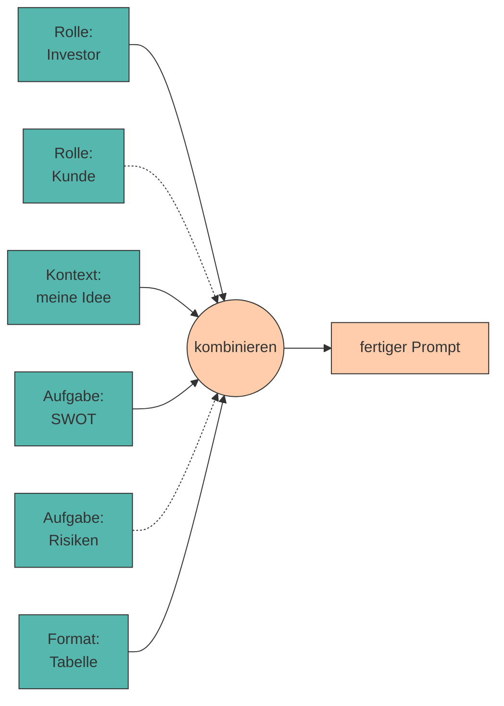

# 11. Prompt Libraries und Wiederverwendung

Bewährte Prompts müssen nicht jedes Mal neu erfunden werden. **Prompt Libraries** sammeln, strukturieren und standardisieren erprobte Prompts für den wiederholten Einsatz – besonders wertvoll im Unternehmenskontext.

Damit schließt sich der Kreis: Du hast durch den ganzen Kurs Prompts entwickelt und verbessert. Jetzt machst du daraus ein **Werkzeug**, das dich über den Kurs hinaus begleitet.

---

## Warum sich das lohnt

!!! quote "Merksatz"

    Ein guter Prompt ist kein Wegwerfprodukt. Er ist **Arbeitsergebnis** – so wie eine Excel-Vorlage oder ein Codebaustein.

<div class="grid cards" markdown>

- :material-clock-fast: **Zeit**

    ---

    Ein erprobter Prompt spart die drei bis fünf [Iterationen](iteratives.md), die du beim ersten Mal gebraucht hast.

- :material-equal: **Konsistenz**

    ---

    Zehn Personen im Team erzeugen mit demselben Prompt vergleichbare Ergebnisse – statt zehn unterschiedliche.

- :material-trending-up: **Qualität**

    ---

    Verbesserungen kommen allen zugute. Der Prompt wird über die Zeit besser, nicht jedes Mal neu erfunden.

- :material-school: **Wissenstransfer**

    ---

    Neue Teammitglieder starten mit dem gesammelten Erfahrungswissen statt bei null.

</div>

---

## Modularisierung

Zerlege deine Prompts in **wiederverwendbare Bausteine** – im Grunde die fünf Elemente aus [Kapitel 2](anatomie.md), jetzt als getrennte Textblöcke:



Vier Rollen × drei Aufgaben × zwei Formate ergeben **24 Prompts** aus neun Bausteinen. Das ist der eigentliche Gewinn der Modularisierung.

---

## Templates mit Platzhaltern

Ein **Template** ist ein Prompt, in dem die veränderlichen Teile durch Platzhalter ersetzt sind:

```markdown title="templates/swot.md"
---
name: swot-analyse
version: 2
getestet_mit: qwen2.5:0.5b, llama3.2:1b
autor: M. Mustermann
---

Du bist {rolle} mit {erfahrung} Jahren Erfahrung in {branche}.

KONTEXT:
{kontext}

AUFGABE:
Erstelle eine SWOT-Analyse. Genau {anzahl} Punkte pro Kategorie.

FORMAT:
STÄRKEN: ...
SCHWÄCHEN: ...
CHANCEN: ...
RISIKEN: ...

Antworte auf Deutsch. Keine Einleitung.
```

???+ tip "Was in die Metadaten gehört"

    Der Block zwischen den `---` ist wertvoller, als er aussieht:

    - **`version`** – damit du Verbesserungen nachvollziehen kannst
    - **`getestet_mit`** – ein Prompt, der auf GPT-5 funktioniert, kann auf `qwen2.5:0.5b` scheitern. Diese Angabe verhindert falsche Erwartungen.
    - **`autor`** – wer weiß, warum der Prompt so formuliert ist

---

## Skills: die nächste Stufe

???+ defi "Skill"

    Ein **Skill** ist ein Paket aus Anweisung, Beispielen und optional Hilfsdateien oder Code, das ein KI-System bei Bedarf **selbstständig lädt** – ohne dass du es jedes Mal in den Prompt kopierst.

    Der Unterschied zum Template:

    | | Template | Skill |
    |---|---|---|
    | Aufruf | du kopierst es hinein | das System lädt es bei Bedarf |
    | Umfang | ein Textblock | Anweisung + Beispiele + Dateien |
    | Kontextfenster | immer voll belegt | nur belegt, wenn gebraucht |

Der Gedanke dahinter ist derselbe wie bei einer Funktionsbibliothek im Programmieren: **einmal sauber schreiben, überall verwenden**. Wenn dein Prompt-Ordner gut strukturiert ist, hast du bereits die Vorstufe davon gebaut.

---

## Im Unternehmen

???+ process "Von der privaten Sammlung zur Team-Bibliothek"

    1. **Sammeln** – jeder legt seine funktionierenden Prompts an einem gemeinsamen Ort ab.
    2. **Standardisieren** – einheitliche Struktur, Metadaten, Namensschema.
    3. **Versionieren** – am besten in Git. Dann ist jede Änderung nachvollziehbar und rückgängig zu machen.
    4. **Testen** – für kritische Prompts ein paar feste Testfälle, wie in [Kapitel 4](iteratives.md).
    5. **Pflegen** – eine verantwortliche Person pro Bereich. Ohne Pflege veraltet eine Bibliothek schnell.

!!! warning "Vertraulichkeit"

    Prompts enthalten oft **Kontext** – Kundennamen, Zahlen, Strategien. Ein Prompt-Repository ist damit potenziell so sensibel wie eine Kundendatenbank.

    👉 Trenne **Template** (teilbar) von **Kontext** (vertraulich). Genau dafür sind Platzhalter da.

---

## 🔬 Ollama-Labor

!!! example "Übung 1: Template-Engine mit Bordmitteln"

    Python kann Platzhalter ohne jede Zusatzbibliothek füllen.

    ```python title="template.py"
    from string import Template

    vorlage = Template("""Du bist $rolle mit $erfahrung Jahren Erfahrung in $branche.

    KONTEXT:
    $kontext

    AUFGABE:
    Erstelle eine SWOT-Analyse. Genau $anzahl Punkte pro Kategorie.

    FORMAT:
    STÄRKEN: ...
    SCHWÄCHEN: ...
    CHANCEN: ...
    RISIKEN: ...

    Antworte auf Deutsch. Keine Einleitung.""")

    prompt = vorlage.substitute(
        rolle="Business Angel",
        erfahrung=15,
        branche="der Lebensmittelbranche",
        kontext="Bio-Lieferdienst in Innsbruck, 2 Gründer, 15.000 € Startkapital.",
        anzahl=2,
    )

    print(prompt)

    from llm import frage
    print("\n" + "=" * 60 + "\n")
    print(frage(prompt))
    ```

    **Warum `string.Template` und nicht f-Strings?** Weil `substitute()` einen **Fehler wirft**, wenn ein Platzhalter fehlt. Bei f-Strings merkst du erst an der schlechten Antwort, dass `{kontext}` leer geblieben ist.

!!! example "Übung 2: Die Bibliothek als Klasse"

    ```python title="prompt_library.py"
    from pathlib import Path
    from string import Template


    class PromptLibrary:
        """Lädt Prompt-Templates aus einem Ordner und füllt sie aus."""

        def __init__(self, ordner="templates"):
            self.ordner = Path(ordner)
            self.templates = {}
            self._laden()

        def _laden(self):
            for datei in self.ordner.glob("*.md"):
                self.templates[datei.stem] = datei.read_text(encoding="utf-8")
            print(f"📚 {len(self.templates)} Templates geladen: "
                  f"{', '.join(sorted(self.templates))}")

        def zeige(self, name):
            """Gibt das rohe Template samt Platzhaltern aus."""
            print(self.templates[name])

        def baue(self, name, **werte):
            """Füllt ein Template. Wirft KeyError, wenn ein Wert fehlt."""
            if name not in self.templates:
                raise KeyError(f"Template '{name}' nicht gefunden. "
                               f"Verfügbar: {', '.join(sorted(self.templates))}")
            return Template(self.templates[name]).substitute(**werte)


    if __name__ == "__main__":
        lib = PromptLibrary()
        prompt = lib.baue("swot",
                          rolle="Business Angel",
                          erfahrung=15,
                          branche="der Lebensmittelbranche",
                          kontext="Bio-Lieferdienst in Innsbruck.",
                          anzahl=2)
        print(prompt)
    ```

    Lege einen Ordner `templates/` an, speichere dort `swot.md` (ohne den Metadaten-Block, den `Template` nicht kennt) und probiere es aus.

??? question "Übung 3: Bibliothek mit Metadaten und Testlauf (Python)"

    Erweitere die Klasse um zwei Fähigkeiten: Metadaten lesen und alle Templates auf einmal testen.

    ```python title="prompt_library_pro.py"
    class PromptLibraryPro(PromptLibrary):

        def metadaten(self, name):
            """Liest den ----Block am Dateianfang als dict."""
            # TODO 1: Text am ersten und zweiten "---" trennen
            # TODO 2: jede Zeile an ":" aufteilen → dict
            # TODO 3: dict zurückgeben (leeres dict, wenn kein Block da ist)
            ...

        def teste_alle(self, testwerte):
            """Baut jedes Template mit Testwerten und meldet fehlende Platzhalter."""
            # TODO 4: über alle Templates iterieren
            # TODO 5: baue() in try/except aufrufen
            # TODO 6: ✅ / ❌ pro Template ausgeben
            ...
    ```

    ??? success "Lösungsvorschlag"

        ```python title="prompt_library_pro.py"
        from string import Template


        class PromptLibraryPro(PromptLibrary):

            def metadaten(self, name):
                text = self.templates[name]
                if not text.startswith("---"):
                    return {}

                _, block, _ = text.split("---", 2)
                meta = {}
                for zeile in block.strip().splitlines():
                    if ":" in zeile:
                        schluessel, wert = zeile.split(":", 1)
                        meta[schluessel.strip()] = wert.strip()
                return meta

            def _koerper(self, name):
                """Template ohne Metadatenblock."""
                text = self.templates[name]
                return text.split("---", 2)[2] if text.startswith("---") else text

            def baue(self, name, **werte):
                return Template(self._koerper(name)).substitute(**werte)

            def teste_alle(self, testwerte):
                print(f"\n{'Template':<20} {'Version':<9} Status")
                print("-" * 60)

                for name in sorted(self.templates):
                    meta = self.metadaten(name)
                    version = meta.get("version", "–")
                    try:
                        self.baue(name, **testwerte)
                        print(f"{name:<20} {version:<9} ✅ ok")
                    except KeyError as fehler:
                        print(f"{name:<20} {version:<9} ❌ fehlt: {fehler}")
        ```

        **Warum ein Testlauf?** Sobald du zehn Templates hast, weißt du nicht mehr auswendig, welche Platzhalter jedes braucht. `teste_alle()` sagt es dir in einer Sekunde – und fängt Tippfehler in Platzhalternamen ab, bevor sie in einem halb ausgefüllten Prompt landen.

---

???+ question "Selbsttest"

    1. Warum ist Modularisierung wirkungsvoller, als fertige Prompts zu sammeln?
    2. Was gehört in die Metadaten eines Templates und warum ist `getestet_mit` besonders wichtig?
    3. Worin unterscheidet sich ein Skill von einem Template?

    ??? success "Lösungsskizze"

        1. Weil sich Bausteine **kombinieren** lassen: Aus vier Rollen, drei Aufgaben und zwei Formaten entstehen 24 Prompts aus nur neun Bausteinen. Fertige Prompts musst du dagegen einzeln pflegen.
        2. Name, Version, Autor und die getesteten Modelle. `getestet_mit` ist wichtig, weil Prompts modellabhängig sind – ein Prompt, der auf einem großen Modell zuverlässig läuft, kann auf `qwen2.5:0.5b` komplett scheitern.
        3. Ein Template ist ein Textblock, den **du** einfügst. Ein Skill ist ein Paket aus Anweisung, Beispielen und ggf. Dateien, das das System **bei Bedarf selbst lädt** – es belegt das Kontextfenster nur, wenn es gebraucht wird.

---

!!! example "Lab"

    **Eigene Prompt-Bibliothek erstellen**

    Fasse die besten Prompts aus dem gesamten Kurs zu einer eigenen, modular aufgebauten Prompt-Bibliothek zusammen. Versieh sie mit Templates und Platzhaltern, damit du sie für künftige Projekte wiederverwenden kannst.

    **Konkrete Schritte:**

    1. Sammle deine gespeicherten Prompts aus `prompts/01_*` bis `prompts/08_*`.
    2. Ersetze alle idee-spezifischen Stellen durch **Platzhalter** (`$kontext`, `$rolle`, `$branche`, …).
    3. Ergänze für jedes Template einen **Metadatenblock** mit `name`, `version` und `getestet_mit`.
    4. Lege sie im Ordner `templates/` ab und lade sie mit `PromptLibraryPro`.
    5. Lass `teste_alle()` laufen, bis alle Templates ✅ melden.
    6. **Der Härtetest:** Wende deine Bibliothek auf eine **völlig andere** Geschäftsidee an (z. B. eine Hundeschule). Welche Templates funktionieren ohne Änderung – und welche waren doch zu speziell?
    7. Versioniere den Ordner mit Git. 🎉

!!! quote "Geschafft! 🎓"

    Du hast den Weg vom ersten „Schreib was über mein Café" bis zu einer versionierten, getesteten Prompt-Bibliothek zurückgelegt – und das Ganze mit Modellen, die auf jedem Laptop laufen.

    Wenn deine Prompts auf `qwen2.5:0.5b` funktionieren, funktionieren sie überall. Nimm sie mit. 🚀

---

## Quellen

!!! info "Literatur"

    - **Anthropic (2025):** *Prompt library.* [https://docs.anthropic.com/en/resources/prompt-library/library](https://docs.anthropic.com/en/resources/prompt-library/library)
    - **Anthropic (2025):** *Agent Skills.* [https://www.anthropic.com/news/skills](https://www.anthropic.com/news/skills)
    - **Zuckarelli, J. (2025):** *Programmieren mit ChatGPT*. Springer Nature. [https://doi.org/10.1007/978-3-662-69433-6](https://doi.org/10.1007/978-3-662-69433-6)

    Zur Ausarbeitung wurden generative Tools unterstützend eingesetzt.
