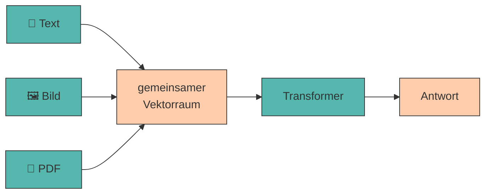

# 9. Multimodales Prompting

Moderne KI-Modelle verarbeiten nicht nur Text, sondern auch **Bilder, Dokumente und Diagramme**. Multimodales Prompting erweitert die Möglichkeiten erheblich – von der Analyse einer Website bis zur Auswertung einer Präsentation.

---

## Was „multimodal" bedeutet

???+ defi "Modalität"

    Eine **Modalität** ist eine Art von Eingabe oder Ausgabe: Text, Bild, Audio, Video. Ein **multimodales Modell** kann mehrere davon gleichzeitig verarbeiten.

    Technisch ändert sich weniger, als man denkt: Ein Bild wird in **Bild-Tokens** zerlegt und wie Text-Tokens in denselben Vektorraum eingebettet. Ab da läuft alles wie in [Station 2](funktionsweise-llms.md#station-2-word-embeddings-wortern-bedeutung-geben) beschrieben – das Modell „sieht" nicht, es rechnet.



!!! warning "Ein Bild kostet viele Tokens"

    Ein einzelnes Bild verbraucht je nach Auflösung schnell **1.000 bis 2.000 Tokens** – so viel wie zwei Seiten Text. Bei kleinen Modellen ist das [Kontextfenster](halluzinationen-kontextfenster.md) damit sofort halb voll.

    👉 Ein Bild pro Prompt. Und lieber ein Ausschnitt als ein Screenshot der ganzen Seite.

---

## Die Modalitäten in der Praxis

=== ":material-image: Bilder"

    **Typische Aufgaben:** Produktfotos beschreiben, Logos bewerten, Screenshots analysieren, Handschrift transkribieren.

    ```title="Prompt"
    Beschreibe dieses Produktfoto für einen Online-Shop.
    Nenne: (1) das Produkt, (2) drei sichtbare Eigenschaften,
    (3) die vermutliche Zielgruppe.
    Beschreibe nur, was tatsächlich zu sehen ist.
    ```

    Der letzte Satz ist entscheidend – ohne ihn ergänzt das Modell gern Details, die gar nicht im Bild sind.

=== ":material-file-pdf-box: PDFs"

    **Typische Aufgaben:** Berichte zusammenfassen, Verträge nach Klauseln durchsuchen, Studien auswerten.

    ```title="Prompt"
    Fasse dieses PDF zusammen. Struktur:
    - Kernaussage (1 Satz)
    - 3 wichtigste Zahlen mit Seitenangabe
    - 2 offene Fragen

    Zitiere für jede Zahl die Seite. Findest du eine Angabe nicht,
    schreibe [NICHT IM DOKUMENT].
    ```

    **Achtung:** Manche Werkzeuge extrahieren nur den Text, andere „sehen" die Seite als Bild. Bei Tabellen und Diagrammen macht das einen großen Unterschied.

=== ":material-chart-box-outline: Diagramme"

    **Typische Aufgaben:** Trends aus Charts ablesen, Zahlen aus Grafiken extrahieren.

    ```title="Prompt"
    Lies die Werte aus diesem Balkendiagramm ab.
    Gib sie als Tabelle aus: Kategorie | Wert | abgelesen/geschätzt.
    Markiere jeden Wert, den du nicht eindeutig ablesen kannst,
    als "geschätzt".
    ```

    !!! danger "Zahlen aus Diagrammen sind unzuverlässig"

        Das Ablesen exakter Werte gehört zu den fehleranfälligsten Aufgaben überhaupt. Nutze es für **Trends** („steigt seit 2021"), nicht für **Zahlen** in einer Präsentation.

=== ":material-presentation: Präsentationen"

    **Typische Aufgaben:** Pitchdecks analysieren, Foliensätze zusammenfassen, Argumentationslinien prüfen.

    ```title="Prompt"
    Du bist Investorin und siehst dieses Pitchdeck zum ersten Mal.

    1. Welche Kernaussage nimmst du mit?
    2. Welche Information fehlt dir, um zu entscheiden?
    3. Welche Folie würdest du streichen?
    ```

    Kombiniert Multimodalität mit [rollenbasiertem Prompting](rollen.md) – besonders wirkungsvoll.

---

## Agenten :material-paperclip:

Wenn ein Modell nicht nur *antwortet*, sondern **Werkzeuge benutzt** – eine Website aufrufen, ein PDF öffnen, Code ausführen, eine Datei schreiben – spricht man von einem **Agenten**.

???+ defi "Agent"

    Ein System, das ein LLM in einer Schleife betreibt: *Ziel verstehen → Werkzeug wählen → ausführen → Ergebnis bewerten → nächster Schritt*, bis das Ziel erreicht ist.

    Der Unterschied zu [Prompt Chaining](chaining.md): Bei einer Kette legst **du** die Schritte vorher fest. Ein Agent entscheidet **selbst**, welcher Schritt als Nächstes kommt.

<div class="grid cards" markdown>

- :material-web: **Web-Recherche**

    ---

    Das Modell sucht selbstständig, öffnet Seiten und fasst zusammen – mit Quellenangabe.

- :material-file-search-outline: **Dokumenten-Analyse**

    ---

    Mehrere PDFs werden geöffnet, verglichen und in einer Tabelle gegenübergestellt.

- :material-code-braces: **Code-Ausführung**

    ---

    Berechnungen werden nicht *geschätzt*, sondern tatsächlich gerechnet – ein direktes Gegenmittel zur [Rechenschwäche](staerken-grenzen.md) von LLMs.

</div>

!!! tip "Mehr Fähigkeit heißt mehr Prüfpflicht"

    Ein Agent, der zehn Schritte selbst entscheidet, kann auch zehnmal falsch abbiegen – und begründet das Ergebnis am Ende überzeugend. Prüfe bei Agenten immer den **Weg**, nicht nur das Ergebnis.

---

## 🔬 Ollama-Labor

Für Bilder brauchst du ein **Vision-Modell**. Unsere Textmodelle können das nicht.

!!! info "Zusätzliches Modell nötig"

    ```bash
    ollama pull moondream
    ```

    **~1,7 GB** · Das kleinste brauchbare Vision-Modell. Es versteht **nur Englisch** – wir prompten hier also auf Englisch und lassen ins Deutsche übersetzen.

    Kein Speicherplatz? Dann überspringe Übung 1 und 2 und bearbeite stattdessen die **Alternative** weiter unten mit einem Browser-Modell.

!!! example "Übung 1: Was sieht das Modell wirklich?"

    Lege ein beliebiges Foto als `produkt.jpg` in deinen Arbeitsordner. Im Terminal gibst du den **Dateipfad einfach im Prompt mit an** – Ollama erkennt ihn und lädt das Bild.

    ```bash
    ollama run moondream "Describe this image. ./produkt.jpg"
    ```

    ```title="Beispielausgabe — offener Prompt"
    A wooden crate filled with fresh organic vegetables sits on a rustic
    kitchen table. The scene suggests a farm-to-table lifestyle, with warm
    morning light streaming through a nearby window. The produce looks
    freshly harvested from a local farm.
    ```

    Klingt gut – aber wie viel davon steht wirklich im Bild? „Morgenlicht", „frisch geerntet", „vom lokalen Bauernhof": Das sind **Interpretationen**, keine Beobachtungen.

    ```bash
    ollama run moondream "Describe only what is literally visible: objects, colors, text. Do not guess or interpret. ./produkt.jpg"
    ```

    ```title="Beispielausgabe — gelenkter Prompt"
    A wooden crate containing green and orange vegetables. The crate sits on
    a light brown surface. The background is blurred and mostly white.
    ```

    **Deine Aufgabe:** Markiere in der ersten Ausgabe jede Aussage, die du im Bild **nicht** belegen kannst. Probiere zusätzlich eine strukturierte Variante (*„List exactly 3 visible objects, one per line, format: OBJECT: &lt;name&gt;"*). Welcher Prompt reduziert das Erfinden am stärksten?

!!! example "Übung 2: Bild + Übersetzung als Kette"

    `moondream` kann kein Deutsch – aber `qwen2.5:0.5b` schon. Kombiniere beide zu einer [Kette](chaining.md).

    **Schritt 1** – Vision-Modell beschreibt auf Englisch:

    ```bash
    ollama run moondream "Describe this product photo factually in 3 sentences. ./produkt.jpg"
    ```

    ```title="Beispielausgabe"
    A wooden crate containing carrots, lettuce and tomatoes. The vegetables
    appear unpackaged. A paper label is attached to the front of the crate.
    ```

    **Schritt 2** – Textmodell macht daraus deutschen Verkaufstext. Kopiere die englische Beschreibung in den Prompt:

    ```title="Terminal"
    ollama run qwen2.5:0.5b

    >>> """
    ... Hier ist eine englische Bildbeschreibung:
    ... A wooden crate containing carrots, lettuce and tomatoes. The vegetables
    ... appear unpackaged. A paper label is attached to the front of the crate.
    ...
    ... Schreibe daraus eine deutsche Produktbeschreibung für einen Online-Shop.
    ... Maximal 40 Wörter, sachlich, keine Superlative.
    ... """
    ```

    ```title="Beispielausgabe"
    Unsere Holzkiste enthält Karotten, Salat und Tomaten – unverpackt und
    direkt aus der Region. Ein Etikett an der Vorderseite nennt Herkunft und
    Erntedatum der enthaltenen Ware.
    ```

    **Das Prinzip ist wichtiger als das Ergebnis:** Zwei spezialisierte kleine Modelle in Reihe schlagen oft ein einzelnes mittleres Modell.

!!! example "Übung 3: Website-Text auswerten (ohne Vision-Modell)"

    Funktioniert mit dem normalen Kursmodell. Öffne die Website eines Unternehmens deiner Branche, markiere den sichtbaren Text (<kbd>Strg</kbd>+<kbd>A</kbd>, <kbd>Strg</kbd>+<kbd>C</kbd>) und füge ihn in diesen Prompt ein:

    ```title="Terminal"
    >>> """
    ... Hier ist der Text einer Unternehmenswebsite:
    ...
    ... [hier den kopierten Text einfügen]
    ...
    ... Leite daraus ab:
    ... WERTANGEBOT: <ein Satz>
    ... ZIELGRUPPE: <ein Satz>
    ... ERLÖSMODELL: <ein Satz, oder [UNKLAR]>
    ...
    ... Nutze ausschließlich Informationen aus dem Text. Was nicht dort steht,
    ... markierst du mit [UNKLAR].
    ... """
    ```

    ```title="Beispielausgabe"
    WERTANGEBOT: Wöchentliche Lieferung saisonaler Bio-Kisten von Höfen aus
    der Umgebung, ohne Vertragsbindung.
    ZIELGRUPPE: Haushalte, die regionale Lebensmittel bevorzugen, aber keine
    Zeit für den Wocheneinkauf haben.
    ERLÖSMODELL: [UNKLAR] – auf der Seite sind keine Preise angegeben.
    ```

    !!! warning "Zwei Dinge, auf die du achten musst"

        **Kürze den Text.** Das [Kontextfenster](halluzinationen-kontextfenster.md) von `qwen2.5:0.5b` ist klein. Fügst du eine ganze Website ein, verliert das Modell den Anfang – und damit deine Anweisung. Etwa 2–3 Bildschirmseiten sind das Maximum.

        **Der letzte Satz im Prompt ist dein wichtigster Schutz.** Ohne *„Nutze ausschließlich Informationen aus dem Text"* ergänzt das Modell fröhlich, was auf so einer Website *üblicherweise* steht – und du merkst es nicht.

    **Deine Aufgabe:** Prüfe jede der drei Ausgaben gegen den Originaltext. Steht das wirklich dort? Wie oft nutzt das Modell `[UNKLAR]`, obwohl es raten könnte – und wie oft rät es, obwohl es `[UNKLAR]` schreiben sollte?

??? code "🐍 Optional (Python): Website-Text automatisch holen"

    Copy-Paste geht für zwei Websites. Für zwanzig lohnt sich das hier:

    ```python title="webanalyse.py"
    # pip install requests beautifulsoup4
    import requests
    from bs4 import BeautifulSoup
    from llm import frage


    def hole_text(url, max_zeichen=3000):
        antwort = requests.get(url, timeout=10,
                               headers={"User-Agent": "Mozilla/5.0"})
        antwort.raise_for_status()

        suppe = BeautifulSoup(antwort.text, "html.parser")
        for tag in suppe(["script", "style", "nav", "footer"]):
            tag.decompose()

        return " ".join(suppe.get_text(separator=" ").split())[:max_zeichen]


    text = hole_text("https://example.com")
    print(f"📄 {len(text)} Zeichen geladen\n")

    print(frage(f"""Hier ist der Text einer Unternehmenswebsite:

    {text}

    Leite daraus ab:
    WERTANGEBOT: <ein Satz>
    ZIELGRUPPE: <ein Satz>
    ERLÖSMODELL: <ein Satz, oder [UNKLAR]>

    Nutze ausschließlich Informationen aus dem Text."""))
    ```

    ```title="Ausgabe"
    📄 1247 Zeichen geladen

    WERTANGEBOT: Wöchentliche Lieferung saisonaler Bio-Kisten ...
    ZIELGRUPPE: Haushalte, die regionale Lebensmittel bevorzugen ...
    ERLÖSMODELL: [UNKLAR] – auf der Seite sind keine Preise angegeben.
    ```

    Die Zeile `[:max_zeichen]` ist keine Bequemlichkeit, sondern Notwendigkeit – sie erzwingt genau die Kürzung, die du oben von Hand machst.

??? tip "Alternative ohne lokales Vision-Modell"

    Nutze ein Browser-Modell (ChatGPT, Claude, Gemini – jeweils kostenlose Version) für die Bild-Aufgaben:

    1. Lade den Screenshot einer Unternehmenswebsite hoch.
    2. Prompte: *„Leite aus dieser Seite das Business Model Canvas ab. Markiere jedes Feld, das du nur vermutest, mit [ANNAHME]."*
    3. Zähle anschließend, wie viele Felder mit `[ANNAHME]` markiert sind – das ist dein Unsicherheitsmaß.

    **Datenschutz-Hinweis:** Alles, was du hochlädst, verlässt dein Gerät. Keine personenbezogenen Daten, keine internen Unterlagen. Genau dieser Punkt ist einer der Gründe, warum wir im Kurs lokal arbeiten.

---

???+ question "Selbsttest"

    1. Was passiert technisch mit einem Bild, bevor das Modell es verarbeitet?
    2. Warum sind aus Diagrammen abgelesene Zahlen unzuverlässig?
    3. Worin unterscheidet sich ein Agent von einer Prompt-Kette?

    ??? success "Lösungsskizze"

        1. Es wird in **Bild-Tokens** zerlegt und in denselben Vektorraum eingebettet wie Text. Danach ist es für den Transformer nur noch eine weitere Token-Folge – es wird gerechnet, nicht „gesehen".
        2. Weil das Modell keine Werte misst, sondern **plausible Zahlen vorhersagt**. Für Trends reicht das; für exakte Werte nicht.
        3. Bei einer Kette legst du die Schritte **vorab** fest. Ein Agent entscheidet **selbst**, welches Werkzeug er als Nächstes einsetzt – mächtiger, aber schwerer zu kontrollieren.

---

!!! example "Lab"

    **Analyse existierender Geschäftsmodelle**

    Analysiere bestehende Geschäftsmodelle anhand von Webseiten oder Präsentationen. Lass dir Stärken, Schwächen und Erfolgsfaktoren herausarbeiten und vergleiche sie mit deiner eigenen Idee.

    **Konkrete Schritte:**

    1. Wähle **zwei** existierende Unternehmen aus deiner Branche.
    2. Kopiere ihre Website-Texte in das Analyse-Muster aus Übung 3.
    3. Lass für beide ein Business Model Canvas ableiten – mit `[ANNAHME]`-Markierung für alles Erschlossene.
    4. Stelle beide Canvas und dein eigenes in einer **Vergleichstabelle** gegenüber.
    5. Beantworte: Welches Feld füllen die etablierten Anbieter besser als du – und warum?
    6. Notiere den Analyse-Prompt in `prompts.md` unter `## 07 Wettbewerb`.

---

## Quellen

!!! info "Literatur"

    - **Ollama (2025):** *Vision models.* [https://ollama.com/search?c=vision](https://ollama.com/search?c=vision)
    - **Radford, A. et al. (2021):** *Learning Transferable Visual Models From Natural Language Supervision (CLIP).* arXiv:2103.00020. [https://arxiv.org/abs/2103.00020](https://arxiv.org/abs/2103.00020)
    - **Anthropic (2025):** *Building effective agents.* [https://www.anthropic.com/engineering/building-effective-agents](https://www.anthropic.com/engineering/building-effective-agents)

    Zur Ausarbeitung wurden generative Tools unterstützend eingesetzt.
