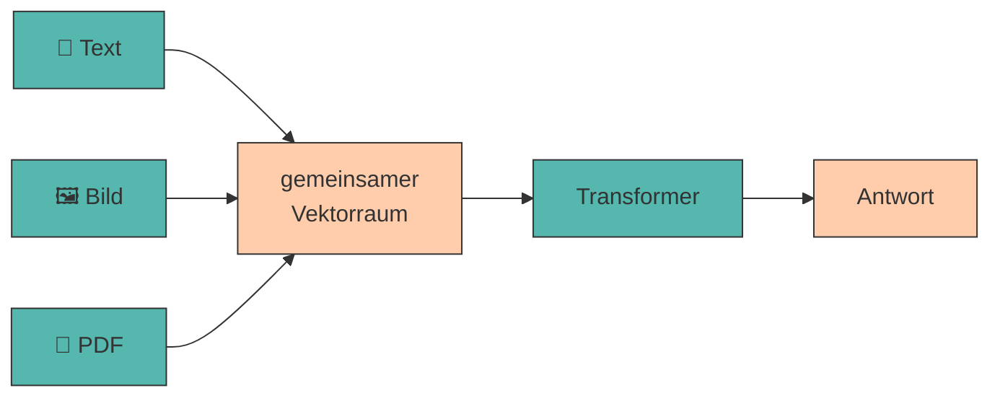

# Multimodales Prompting

Moderne KI-Modelle verarbeiten nicht nur Text, sondern auch **Bilder, Dokumente und Diagramme**. Multimodales Prompting erweitert die Möglichkeiten erheblich - von der Analyse einer Website bis zur Auswertung einer Präsentation.

---

## Was „multimodal" bedeutet

???+ defi "Modalität"

    Eine **Modalität** ist eine Art von Eingabe oder Ausgabe: Text, Bild, Audio, Video. Ein **multimodales Modell** kann mehrere davon gleichzeitig verarbeiten.

    Technisch ändert sich weniger, als man denkt: Ein Bild wird in **Bild-Tokens** zerlegt und wie Text-Tokens in denselben Vektorraum eingebettet. Ab da läuft alles wie in [Station 2](funktionsweise-llms.md#2-word-embeddings) beschrieben - das Modell „sieht" nicht, es rechnet.[^clip]



!!! warning "Ein Bild kostet viele Tokens"

    Ein einzelnes Bild verbraucht je nach Auflösung schnell **1.000 bis 2.000 Tokens** - so viel wie zwei Seiten Text. Bei kleinen Modellen ist das [Kontextfenster](halluzinationen-kontextfenster.md) damit sofort halb voll.

    Ein Bild pro Prompt. Und lieber ein Ausschnitt als ein Screenshot der ganzen Seite.

!!! danger "Unser Kursmodell sieht nichts"

    `gemma3:1b` verarbeitet **ausschließlich Text**. Bei Gemma 3 ist die Bildverarbeitung erst ab der 4B-Variante eingebaut - die 1B-Version wurde als reines Sprachmodell trainiert. Was ein Modell kann, verrät `ollama show` unter **Capabilities**:

    ```title="Terminal"
    ollama show gemma3:1b
    ```

    Dort steht nur `completion`. Bei `gemma3:4b` steht zusätzlich `vision`.

    Achtung: das Modell weist das Bild nicht zurück, auch wenn es keine Bilder lesen kann. Es ignoriert den Dateipfad stillschweigend und erfindet eine Beschreibung.

Die folgenden Beispiele zeigen, wie multimodale Prompts aussehen. Ausprobieren kannst du sie im Labor unten - mit einem Modell, das Bilder tatsächlich annimmt.

---

## Die Modalitäten in der Praxis

=== ":material-image: Bilder"

    **Typische Aufgaben:** Produktfotos beschreiben, Logos bewerten, Screenshots analysieren, Handschrift transkribieren. Möglich wurde das durch Modelle, die Bild- und Textverarbeitung verschränken.[^flamingo]

    ```{.text .ollama title="Ollama Chat"}
    Beschreibe dieses Produktfoto für einen Online-Shop.
    ...Nenne: (1) das Produkt, (2) drei sichtbare Eigenschaften,
    ...(3) die vermutliche Zielgruppe.
    ...Beschreibe nur, was tatsächlich zu sehen ist.
    ```

    Der letzte Satz ist entscheidend - ohne ihn ergänzt das Modell gern Details, die gar nicht im Bild sind.

=== ":material-file-pdf-box: PDFs"

    **Typische Aufgaben:** Berichte zusammenfassen, Verträge nach Klauseln durchsuchen, Studien auswerten.

    ```{.text .ollama title="Ollama Chat"}
    Fasse dieses PDF zusammen. Struktur:
    ...- Kernaussage (1 Satz)
    ...- 3 wichtigste Zahlen mit Seitenangabe
    ...- 2 offene Fragen
    ...
    ...Zitiere für jede Zahl die Seite. Findest du eine Angabe nicht,
    ...schreibe [NICHT IM DOKUMENT].
    ```

    **Achtung:** Manche Werkzeuge extrahieren nur den Text, andere „sehen" die Seite als Bild. Bei Tabellen und Diagrammen macht das einen großen Unterschied.

=== ":material-chart-box-outline: Diagramme"

    **Typische Aufgaben:** Trends aus Charts ablesen, Zahlen aus Grafiken extrahieren.

    ```{.text .ollama title="Ollama Chat"}
    Lies die Werte aus diesem Balkendiagramm ab.
    ...Gib sie als Tabelle aus: Kategorie | Wert | abgelesen/geschätzt.
    ...Markiere jeden Wert, den du nicht eindeutig ablesen kannst,
    ...als "geschätzt".
    ```

    !!! danger "Zahlen aus Diagrammen sind unzuverlässig"

        Das Ablesen exakter Werte gehört zu den fehleranfälligsten Aufgaben überhaupt. Nutze es für **Trends** („steigt seit 2021"), nicht für **Zahlen** in einer Präsentation.

=== ":material-presentation: Präsentationen"

    **Typische Aufgaben:** Pitchdecks analysieren, Foliensätze zusammenfassen, Argumentationslinien prüfen.

    ```{.text .ollama title="Ollama Chat"}
    Du bist Investorin und siehst dieses Pitchdeck zum ersten Mal.
    ...
    ...1. Welche Kernaussage nimmst du mit?
    ...2. Welche Information fehlt dir, um zu entscheiden?
    ...3. Welche Folie würdest du streichen?
    ```

    Kombiniert Multimodalität mit [rollenbasiertem Prompting](rollen.md) - besonders wirkungsvoll.

---

## Agenten

<div style="text-align: center;">
    
    <figcaption>Quelle: <a href="https://imgflip.com/i/az61ja">imgflip</a></figcaption>
</div>

Wenn ein Modell nicht nur *antwortet*, sondern **Werkzeuge benutzt** - eine Website aufrufen, ein PDF öffnen, Code ausführen, eine Datei schreiben - spricht man von einem **Agenten**.

???+ defi "Agent"

    Ein System, das ein LLM in einer Schleife betreibt: *Ziel verstehen → Werkzeug wählen → ausführen → Ergebnis bewerten → nächster Schritt*, bis das Ziel erreicht ist.

    Der Unterschied zu [Prompt Chaining](chaining.md): Bei einer Kette legst **du** die Schritte vorher fest. Ein Agent entscheidet **selbst**, welcher Schritt als Nächstes kommt.


---

## 🔬 Ollama-Lab

Dieses Labor beginnt ausnahmsweise nicht im Terminal, sondern im Browser. Bisher haben wir dir gesagt, welches Modell du laden sollst - diesmal suchst du es dir selbst.

!!! adv "Wenn dein Rechner nicht mitspielt 💻"

    Vision-Modelle sind deutlich größer als `gemma3:1b` - mehrere Gigabyte sind normal. Das Lab fällt deshalb für niemanden aus; es gibt zwei gleichwertige Wege:

    - **Cloud-Modelle.** Der Filter [`?c=cloud`](https://ollama.com/search?c=cloud) zeigt Modelle, die auf Ollamas Servern laufen statt auf deiner Festplatte. Sie brauchen einen kostenlosen Account, aber keinen Speicher. Beachte: Deine Bilder verlassen dabei den Rechner - nimm nichts Persönliches.
    - **Zu zweit arbeiten.** Ein Laptop mit genug Arbeitsspeicher pro Team genügt. Teil 1 und 2 macht ohnehin jede Person für sich.

    Wer ein lokales Modell lädt: `ollama rm <modell>` gibt den Platz danach wieder frei.

!!! lab "Übung 1: Modelle nach Fähigkeit filtern"

    Öffne [ollama.com/search](https://ollama.com/search). Die Modelle lassen sich nach Fähigkeiten filtern: **Vision**, **Tools**, **Thinking**, **Embedding** und **Cloud**. Der Filter steckt auch in der Adresse - [`?c=vision`](https://ollama.com/search?c=vision) zeigt alle Modelle, die Bilder verarbeiten können.

    Verschaffe dir einen Überblick: Wie viele Modelle können sehen? Welche können zusätzlich Werkzeuge benutzen (`tools`) - die Grundlage für die [Agenten](#agenten) von oben?

    Suche dir **drei Vision-Modelle** heraus, die auf deinen Rechner passen. Faustregel: Der Download sollte kleiner sein als dein halber freier Arbeitsspeicher. Notiere zu jedem: Name mit Tag, Größe, Kontextfenster.

!!! lab "Übung 2: Herausfinden, wie eine Datei in den Prompt kommt"

    Das steht nicht in diesem Kapitel - du findest es auf den Modellseiten und in der [Ollama-Dokumentation](https://docs.ollama.com). Beantworte für dich:

    - Wie übergibst du ein **Bild** an `ollama run`?
    - Woran erkennst du in der Ausgabe, dass das Bild tatsächlich angenommen wurde - und nicht bloß ignoriert?
    - Und ein **PDF**: Geht das genauso, oder brauchst du einen Umweg? Wenn ja, welchen?

    Diese Übung ist der eigentliche Kern des Kapitels: Ab hier musst du dir Werkzeuge selbst erschließen. Probier es wirklich erst selbst - schau danach in den Lösungsblock.

    ??? success "Wenn du nicht weiterkommst"

        **Bild:** Du hängst den Dateipfad einfach an den Prompt an - Ollama erkennt ihn selbst und lädt das Bild:

        ```title="Terminal"
        ollama run llava "Beschreibe genau, was auf diesem Bild zu sehen ist: ./laden.jpg"
        ```

        Pfade mit Leerzeichen gehören in Anführungszeichen. Relative Pfade beziehen sich auf das Verzeichnis, in dem du das Terminal geöffnet hast.

        **Angenommen oder ignoriert?** Der verlässlichste Test ist eine Frage, die man ohne das Bild nicht beantworten kann - *„Welche Farbe hat der Hintergrund?"* oder *„Wie viele Personen sind zu sehen?"*. Kommt eine plausible, aber vage Antwort ohne Bezug zum Bild, wurde der Pfad als Text gelesen und nicht als Datei. Ein Modell ohne `vision`-Fähigkeit sagt das übrigens meist nicht dazu - es beschreibt einfach irgendetwas.

        **PDF:** Nein, das geht nicht genauso. Ollama nimmt Bilder entgegen, keine Dokumente. Du brauchst einen Umweg - entweder den Text extrahieren (`pdftotext`, Python-Bibliotheken) und als Text mitschicken, oder die Seiten in PNGs umwandeln und als Bilder übergeben. Beides sind zwei Schritte, keine Ollama-Funktion.

!!! lab "Übung 3: Ausprobieren"

    Lade eines deiner drei Modelle mit `ollama pull` und schicke ihm ein Bild, das zu deiner Geschäftsidee passt - ein Produkt, ein Ladenlokal, ein Regal. Verlange ausdrücklich, nur zu beschreiben, was wirklich zu sehen ist.

    **Prüfe:** Markiere jede Aussage, die du im Bild nicht belegen kannst. Schicke denselben Prompt anschließend an `gemma3:1b`, das kein `vision` kann. Der Unterschied zwischen beiden Antworten ist die eigentliche Lektion dieses Kapitels.

    Notiere Modellwahl und Prompt in `prompts.md` unter `## 07 Multimodal`.

    ??? success "Was du beobachten solltest"

        Das Vision-Modell beschreibt zuverlässig, was groß und mittig im Bild ist - und wird unzuverlässig bei Details: Schrift auf Verpackungen, Zahlen, Mengenangaben, Gesichtsausdrücke.

        Auffällig ist die Sorte Fehler: Es erfindet **Plausibles**. Auf dem Foto eines Gemüseregals stehen dann „frische Bio-Tomaten aus der Region" - obwohl kein Schild das hergibt. Das ist dieselbe [Halluzination](halluzinationen-kontextfenster.md) wie im Text, nur schwerer zu bemerken, weil das Bild als Beleg wirkt.

        `gemma3:1b` antwortet trotzdem - flüssig, ausführlich und komplett erfunden, denn es hat nie ein Bild gesehen. **Ein Modell sagt dir nicht, dass es etwas nicht kann.**

??? code "🐍 Optional (Python): Bilder programmatisch übergeben"

    In Python geht das Bild nicht über den Prompttext, sondern über ein eigenes Feld `images` - eine Liste von Dateipfaden:

    ```python title="bild_beschreiben.py"
    import ollama

    antwort = ollama.chat(
        model="llava",
        messages=[{
            "role": "user",
            "content": ("Beschreibe ausschließlich, was tatsächlich zu sehen ist. "
                        "Wenn du etwas nicht erkennen kannst, schreibe 'nicht erkennbar'."),
            "images": ["./laden.jpg"],
        }],
        options={"temperature": 0.1},
    )

    print(antwort["message"]["content"])
    ```

    Zwei Dinge lohnen sich hier:

    - **`temperature` niedrig setzen.** Bei einer Beschreibungsaufgabe willst du keine Kreativität, sondern Wiedergabe.
    - **Die Ausrede erlauben.** Der Satz *„schreibe 'nicht erkennbar'"* gibt dem Modell einen zulässigen Ausweg. Ohne ihn ist Erfinden die einzige Möglichkeit, die Aufgabe zu erfüllen - dieselbe Technik, die in [Evaluation von KI-Ergebnissen](evaluation.md) gegen Halluzinationen hilft.

    Mit einer Schleife über mehrere Bilder hast du damit in fünf Zeilen einen Beschreibungs-Stapelbetrieb - etwa für einen ganzen Produktkatalog.

---

## Quellen

Zur Ausarbeitung wurden generative Tools unterstützend eingesetzt.

[^clip]: **Radford, A., Kim, J. W., Hallacy, C. et al. (2021):** *Learning Transferable Visual Models From Natural Language Supervision.* arXiv:2103.00020. [https://arxiv.org/abs/2103.00020](https://arxiv.org/abs/2103.00020) - das CLIP-Paper: Bilder und Texte werden in **denselben Vektorraum** eingebettet. Genau der Mechanismus aus dem Diagramm oben - und die Grundlage praktisch aller heutigen Vision-Modelle.
[^flamingo]: **Alayrac, J.-B., Donahue, J., Luc, P. et al. (2022):** *Flamingo: a Visual Language Model for Few-Shot Learning.* arXiv:2204.14198. [https://arxiv.org/abs/2204.14198](https://arxiv.org/abs/2204.14198) - zeigt, wie ein Bildencoder mit einem Sprachmodell verbunden wird, sodass Bild und Text **verschränkt** im selben Prompt verarbeitet werden können.
[^llava]: **Liu, H., Li, C., Wu, Q. et al. (2023):** *Visual Instruction Tuning.* arXiv:2304.08485. [https://arxiv.org/abs/2304.08485](https://arxiv.org/abs/2304.08485) - das LLaVA-Paper, aus dessen Ansatz die heute frei verfügbaren Vision-Modelle hervorgegangen sind - auch das kleine `moondream` aus dem Labor.