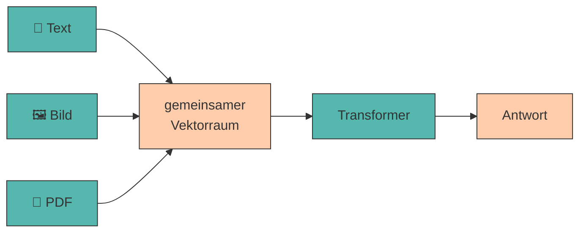

# 9. Multimodales Prompting

Moderne KI-Modelle verarbeiten nicht nur Text, sondern auch **Bilder, Dokumente und Diagramme**. Multimodales Prompting erweitert die Möglichkeiten erheblich – von der Analyse einer Website bis zur Auswertung einer Präsentation.

---

## Was „multimodal" bedeutet

???+ defi "Modalität"

    Eine **Modalität** ist eine Art von Eingabe oder Ausgabe: Text, Bild, Audio, Video. Ein **multimodales Modell** kann mehrere davon gleichzeitig verarbeiten.

    Technisch ändert sich weniger, als man denkt: Ein Bild wird in **Bild-Tokens** zerlegt und wie Text-Tokens in denselben Vektorraum eingebettet. Ab da läuft alles wie in [Station 2](funktionsweise-llms.md#2-word-embeddings) beschrieben – das Modell „sieht" nicht, es rechnet.[^clip]



!!! warning "Ein Bild kostet viele Tokens"

    Ein einzelnes Bild verbraucht je nach Auflösung schnell **1.000 bis 2.000 Tokens** – so viel wie zwei Seiten Text. Bei kleinen Modellen ist das [Kontextfenster](halluzinationen-kontextfenster.md) damit sofort halb voll.

    👉 Ein Bild pro Prompt. Und lieber ein Ausschnitt als ein Screenshot der ganzen Seite.

---

## Die Modalitäten in der Praxis

=== ":material-image: Bilder"

    **Typische Aufgaben:** Produktfotos beschreiben, Logos bewerten, Screenshots analysieren, Handschrift transkribieren. Möglich wurde das durch Modelle, die Bild- und Textverarbeitung verschränken.[^flamingo]

    ```title="Prompt"
    Beschreibe dieses Produktfoto für einen Online-Shop.
    Nenne: (1) das Produkt, (2) drei sichtbare Eigenschaften,
    (3) die vermutliche Zielgruppe.
    Beschreibe nur, was tatsächlich zu sehen ist.
    ```

    Der letzte Satz ist entscheidend – ohne ihn ergänzt das Modell gern Details, die gar nicht im Bild sind.

=== ":material-file-pdf-box: PDFs"

    **Typische Aufgaben:** Berichte zusammenfassen, Verträge nach Klauseln durchsuchen, Studien auswerten.

    ```title="Prompt"
    Fasse dieses PDF zusammen. Struktur:
    - Kernaussage (1 Satz)
    - 3 wichtigste Zahlen mit Seitenangabe
    - 2 offene Fragen

    Zitiere für jede Zahl die Seite. Findest du eine Angabe nicht,
    schreibe [NICHT IM DOKUMENT].
    ```

    **Achtung:** Manche Werkzeuge extrahieren nur den Text, andere „sehen" die Seite als Bild. Bei Tabellen und Diagrammen macht das einen großen Unterschied.

=== ":material-chart-box-outline: Diagramme"

    **Typische Aufgaben:** Trends aus Charts ablesen, Zahlen aus Grafiken extrahieren.

    ```title="Prompt"
    Lies die Werte aus diesem Balkendiagramm ab.
    Gib sie als Tabelle aus: Kategorie | Wert | abgelesen/geschätzt.
    Markiere jeden Wert, den du nicht eindeutig ablesen kannst,
    als "geschätzt".
    ```

    !!! danger "Zahlen aus Diagrammen sind unzuverlässig"

        Das Ablesen exakter Werte gehört zu den fehleranfälligsten Aufgaben überhaupt. Nutze es für **Trends** („steigt seit 2021"), nicht für **Zahlen** in einer Präsentation.

=== ":material-presentation: Präsentationen"

    **Typische Aufgaben:** Pitchdecks analysieren, Foliensätze zusammenfassen, Argumentationslinien prüfen.

    ```title="Prompt"
    Du bist Investorin und siehst dieses Pitchdeck zum ersten Mal.

    1. Welche Kernaussage nimmst du mit?
    2. Welche Information fehlt dir, um zu entscheiden?
    3. Welche Folie würdest du streichen?
    ```

    Kombiniert Multimodalität mit [rollenbasiertem Prompting](rollen.md) – besonders wirkungsvoll.

---

## Agenten :material-paperclip:

Wenn ein Modell nicht nur *antwortet*, sondern **Werkzeuge benutzt** – eine Website aufrufen, ein PDF öffnen, Code ausführen, eine Datei schreiben – spricht man von einem **Agenten**.

???+ defi "Agent"

    Ein System, das ein LLM in einer Schleife betreibt: *Ziel verstehen → Werkzeug wählen → ausführen → Ergebnis bewerten → nächster Schritt*, bis das Ziel erreicht ist.

    Der Unterschied zu [Prompt Chaining](chaining.md): Bei einer Kette legst **du** die Schritte vorher fest. Ein Agent entscheidet **selbst**, welcher Schritt als Nächstes kommt.

<div class="grid cards" markdown>

- :material-web: **Web-Recherche**

    ---

    Das Modell sucht selbstständig, öffnet Seiten und fasst zusammen – mit Quellenangabe.

- :material-file-search-outline: **Dokumenten-Analyse**

    ---

    Mehrere PDFs werden geöffnet, verglichen und in einer Tabelle gegenübergestellt.

- :material-code-braces: **Code-Ausführung**

    ---

    Berechnungen werden nicht *geschätzt*, sondern tatsächlich gerechnet – ein direktes Gegenmittel zur [Rechenschwäche](staerken-grenzen.md) von LLMs.

</div>

!!! tip "Mehr Fähigkeit heißt mehr Prüfpflicht"

    Ein Agent, der zehn Schritte selbst entscheidet, kann auch zehnmal falsch abbiegen – und begründet das Ergebnis am Ende überzeugend. Prüfe bei Agenten immer den **Weg**, nicht nur das Ergebnis.

---

## 🔬 Ollama-Lab

Alles ab hier drehst du an **deiner eigenen Geschäftsidee**. Die Beispiele oben im Kapitel zeigen das Verfahren – hier wendest du es an. Terminal auf, `ollama run gemma3:1b`, los.

!!! lab "Übung 1: Website-Text auswerten"

    Funktioniert mit dem normalen Kursmodell, ohne Vision-Modell.

    Suche dir **zwei** existierende Unternehmen aus deiner Branche. Kopiere je den sichtbaren Text ihrer Website (zwei bis drei Bildschirmseiten reichen – mehr sprengt das [Kontextfenster](halluzinationen-kontextfenster.md)).

    Lass daraus ableiten: **WERTANGEBOT**, **ZIELGRUPPE**, **ERLÖSMODELL**. Verlange dabei ausdrücklich, nur Informationen aus dem Text zu verwenden und alles andere mit `[UNKLAR]` zu markieren.

    **Prüfe jede Ausgabe gegen den Originaltext:** Wie oft rät das Modell, obwohl `[UNKLAR]` richtig wäre?

!!! lab "Übung 2: Vergleich mit deiner Idee"

    Stelle die beiden fremden Canvas und dein eigenes in einer **Vergleichstabelle** gegenüber.

    **Beantworte:** Welches Feld füllen die etablierten Anbieter besser als du – und warum?

    Speichere den Analyse-Prompt in `prompts.md` unter `## 07 Wettbewerb`.

??? lab "Übung 3: Mit Bildern arbeiten (optional) 🖼️"

    Braucht ein Vision-Modell: `ollama pull moondream` (~1,7 GB, versteht **nur Englisch**).

    Nimm ein Foto, das zu deiner Idee passt – ein Produkt, ein Ladenlokal, ein Regal. Den Dateipfad gibst du im Prompt mit an.

    1. Lass es **offen** beschreiben (*„Describe this image."*).
    2. Lass es **gelenkt** beschreiben (*„Describe only what is literally visible. Do not guess or interpret."*).

    **Markiere in der ersten Ausgabe jede Aussage, die du im Bild nicht belegen kannst.** Welcher Prompt reduziert das Erfinden stärker?

    **Als Kette:** Lass `moondream` englisch beschreiben und `gemma3:1b` daraus deutschen Verkaufstext machen. Zwei kleine Spezialisten in Reihe schlagen oft ein mittleres Allzweckmodell.

??? code "🐍 Optional (Python): Website-Text automatisch holen"

    Copy-Paste geht für zwei Websites. Für zwanzig lohnt sich das hier:

    ```python title="webanalyse.py"
    # pip install requests beautifulsoup4
    import requests
    from bs4 import BeautifulSoup
    from llm import frage


    def hole_text(url, max_zeichen=3000):
        antwort = requests.get(url, timeout=10,
                               headers={"User-Agent": "Mozilla/5.0"})
        antwort.raise_for_status()

        suppe = BeautifulSoup(antwort.text, "html.parser")
        for tag in suppe(["script", "style", "nav", "footer"]):
            tag.decompose()

        return " ".join(suppe.get_text(separator=" ").split())[:max_zeichen]


    text = hole_text("https://example.com")
    print(f"📄 {len(text)} Zeichen geladen\n")

    print(frage(f"""Hier ist der Text einer Unternehmenswebsite:

    {text}

    Leite daraus ab:
    WERTANGEBOT: <ein Satz>
    ZIELGRUPPE: <ein Satz>
    ERLÖSMODELL: <ein Satz, oder [UNKLAR]>

    Nutze ausschließlich Informationen aus dem Text."""))
    ```

    ```title="Ausgabe"
    📄 1247 Zeichen geladen

    WERTANGEBOT: Wöchentliche Lieferung saisonaler Bio-Kisten ...
    ZIELGRUPPE: Haushalte, die regionale Lebensmittel bevorzugen ...
    ERLÖSMODELL: [UNKLAR] – auf der Seite sind keine Preise angegeben.
    ```

    Die Zeile `[:max_zeichen]` ist keine Bequemlichkeit, sondern Notwendigkeit – sie erzwingt genau die Kürzung, die du oben von Hand machst.

??? tip "Alternative ohne lokales Vision-Modell"

    Nutze ein Browser-Modell (ChatGPT, Claude, Gemini – jeweils kostenlose Version) für die Bild-Aufgaben:

    1. Lade den Screenshot einer Unternehmenswebsite hoch.
    2. Prompte: *„Leite aus dieser Seite das Business Model Canvas ab. Markiere jedes Feld, das du nur vermutest, mit [ANNAHME]."*
    3. Zähle anschließend, wie viele Felder mit `[ANNAHME]` markiert sind – das ist dein Unsicherheitsmaß.

    **Datenschutz-Hinweis:** Alles, was du hochlädst, verlässt dein Gerät. Keine personenbezogenen Daten, keine internen Unterlagen. Genau dieser Punkt ist einer der Gründe, warum wir im Kurs lokal arbeiten.

---

???+

---

???+ question "Selbsttest"

    1. Was passiert technisch mit einem Bild, bevor das Modell es verarbeitet?
    2. Warum sind aus Diagrammen abgelesene Zahlen unzuverlässig?
    3. Worin unterscheidet sich ein Agent von einer Prompt-Kette?

    ??? success "Lösungsskizze"

        1. Es wird in **Bild-Tokens** zerlegt und in denselben Vektorraum eingebettet wie Text. Danach ist es für den Transformer nur noch eine weitere Token-Folge – es wird gerechnet, nicht „gesehen".
        2. Weil das Modell keine Werte misst, sondern **plausible Zahlen vorhersagt**. Für Trends reicht das; für exakte Werte nicht.
        3. Bei einer Kette legst du die Schritte **vorab** fest. Ein Agent entscheidet **selbst**, welches Werkzeug er als Nächstes einsetzt – mächtiger, aber schwerer zu kontrollieren.

---

## Quellen

Zur Ausarbeitung wurden generative Tools unterstützend eingesetzt.

[^clip]: **Radford, A., Kim, J. W., Hallacy, C. et al. (2021):** *Learning Transferable Visual Models From Natural Language Supervision.* arXiv:2103.00020. [https://arxiv.org/abs/2103.00020](https://arxiv.org/abs/2103.00020) — das CLIP-Paper: Bilder und Texte werden in **denselben Vektorraum** eingebettet. Genau der Mechanismus aus dem Diagramm oben – und die Grundlage praktisch aller heutigen Vision-Modelle.
[^flamingo]: **Alayrac, J.-B., Donahue, J., Luc, P. et al. (2022):** *Flamingo: a Visual Language Model for Few-Shot Learning.* arXiv:2204.14198. [https://arxiv.org/abs/2204.14198](https://arxiv.org/abs/2204.14198) — zeigt, wie ein Bildencoder mit einem Sprachmodell verbunden wird, sodass Bild und Text **verschränkt** im selben Prompt verarbeitet werden können.
[^llava]: **Liu, H., Li, C., Wu, Q. et al. (2023):** *Visual Instruction Tuning.* arXiv:2304.08485. [https://arxiv.org/abs/2304.08485](https://arxiv.org/abs/2304.08485) — das LLaVA-Paper, aus dessen Ansatz die heute frei verfügbaren Vision-Modelle hervorgegangen sind – auch das kleine `moondream` aus dem Labor.
!!! info "Werkzeug-Dokumentation"

    - **Ollama Vision-Modelle:** [https://ollama.com/search?c=vision](https://ollama.com/search?c=vision)

    Zur Ausarbeitung wurden generative Tools unterstützend eingesetzt.
