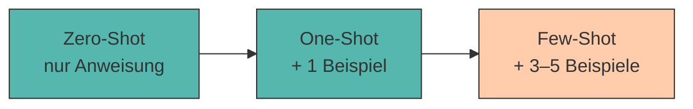

# 3. Zero-Shot, Few-Shot und Beispiel-basiertes Prompting

Manchmal genügt eine reine Anweisung, manchmal helfen **Beispiele** dem Modell, die gewünschte Antwort zu treffen. Die Wahl des richtigen Ansatzes ist eine zentrale Prompting-Entscheidung.

Der Name klingt technischer, als es ist: Ein **Shot** ist schlicht ein *Beispiel*, das du im Prompt mitlieferst. Kein Beispiel = Zero-Shot. Ein paar Beispiele = Few-Shot.

---

## Die drei Ansätze



=== "Zero-Shot"

    Du beschreibst die Aufgabe – ohne ein einziges Beispiel.

    ```title="zero_shot.txt"
    Klassifiziere die folgende Kundenbewertung als positiv, neutral
    oder negativ.

    Bewertung: "Die Lieferung kam pünktlich, aber das Gemüse war welk."
    ```

    **Gut für:** Standardaufgaben, die das Modell aus dem Training kennt (übersetzen, zusammenfassen, klassifizieren).

=== "One-Shot"

    Ein einziges Beispiel zeigt Format *und* Erwartungshaltung.

    ```title="one_shot.txt"
    Klassifiziere Kundenbewertungen.

    Bewertung: "Alles top, gerne wieder!"
    Bewertung: positiv
    Begründung: durchweg zufrieden

    Bewertung: "Die Lieferung kam pünktlich, aber das Gemüse war welk."
    ```

    **Gut für:** wenn vor allem das **Format** klar sein muss.

=== "Few-Shot"

    Mehrere Beispiele – idealerweise auch **Grenzfälle**.

    ```title="few_shot.txt"
    Klassifiziere Kundenbewertungen.

    Bewertung: "Alles top, gerne wieder!"
    Kategorie: positiv

    Bewertung: "Ware kam an. Nichts Besonderes."
    Kategorie: neutral

    Bewertung: "Zwei Tage zu spät und die Hälfte fehlte."
    Kategorie: negativ

    Bewertung: "Super Qualität, aber viel zu teuer."
    Kategorie: neutral

    Bewertung: "Die Lieferung kam pünktlich, aber das Gemüse war welk."
    Kategorie:
    ```

    **Gut für:** Aufgaben mit **eigenen Regeln**, Grenzfällen oder ungewöhnlichem Format.

???+ defi "In-Context Learning"

    Das Modell **lernt** durch Few-Shot-Prompting nicht wirklich dazu – seine Parameter ändern sich nicht. Es erkennt lediglich im Kontext ein **Muster** und setzt es fort. Fachbegriff: *In-Context Learning* (Brown et al., 2020).

    Deshalb ist die Wirkung nach dem Chat auch wieder weg. Wer dauerhaft ein Verhalten will, braucht Fine-Tuning – oder eine [Prompt Library](libraries.md).

---

## Vor- und Nachteile

<div style="text-align:center; max-width:760px; margin:16px auto;">
<table role="table"
       style="width:100%; border-collapse:separate; border-spacing:0; border:1px solid #cfd8e3; border-radius:10px; overflow:hidden; font-family:system-ui,sans-serif;">
    <thead>
    <tr style="background:#009485; color:#fff;">
        <th style="text-align:left; padding:12px 14px; font-weight:700;">Kriterium</th>
        <th style="text-align:center; padding:12px 14px; font-weight:700;">Zero-Shot</th>
        <th style="text-align:center; padding:12px 14px; font-weight:700;">Few-Shot</th>
    </tr>
    </thead>
    <tbody>
    <tr>
        <td style="background:#00948511; padding:10px 14px; font-weight:600;">Aufwand</td>
        <td style="padding:10px 14px; text-align:center;">sehr gering</td>
        <td style="padding:10px 14px; text-align:center;">hoch (Beispiele erstellen)</td>
    </tr>
    <tr>
        <td style="background:#00948511; padding:10px 14px; font-weight:600;">Formattreue</td>
        <td style="padding:10px 14px; text-align:center;">mäßig</td>
        <td style="padding:10px 14px; text-align:center;">sehr hoch</td>
    </tr>
    <tr>
        <td style="background:#00948511; padding:10px 14px; font-weight:600;">Token-Verbrauch</td>
        <td style="padding:10px 14px; text-align:center;">niedrig</td>
        <td style="padding:10px 14px; text-align:center;">hoch</td>
    </tr>
    <tr>
        <td style="background:#00948511; padding:10px 14px; font-weight:600;">Konsistenz</td>
        <td style="padding:10px 14px; text-align:center;">schwankend</td>
        <td style="padding:10px 14px; text-align:center;">stabil</td>
    </tr>
    <tr>
        <td style="background:#00948511; padding:10px 14px; font-weight:600;">Nutzen bei <em>kleinen</em> Modellen</td>
        <td style="padding:10px 14px; text-align:center;">gering</td>
        <td style="padding:10px 14px; text-align:center;">⭐ sehr groß</td>
    </tr>
    </tbody>
</table>
</div>

!!! tip "Der Kurs-Trick"

    Genau die letzte Zeile ist für uns entscheidend. Ein großes Modell braucht selten Beispiele – es rät richtig. **Kleine Modelle profitieren dramatisch von Few-Shot.** Wenn `qwen2.5:0.5b` deine Aufgabe partout nicht versteht: gib ihm zwei Beispiele, statt den Anweisungstext ein viertes Mal umzuformulieren.

---

## Wann welche Methode?

???+ process "Entscheidungshilfe"

    1. **Starte mit Zero-Shot.** Es ist billig und oft ausreichend.
    2. **Ergebnis stimmt inhaltlich, aber das Format wackelt?** → One-Shot mit einem exakten Musterbeispiel.
    3. **Das Modell versteht die Aufgabe grundsätzlich falsch?** → Few-Shot mit 3–5 Beispielen.
    4. **Es gibt Grenzfälle, die immer falsch klassifiziert werden?** → genau diese Grenzfälle als Beispiele aufnehmen.
    5. **Auch mit Few-Shot keine Besserung?** → Aufgabe ist zu groß. Zerlegen: [Prompt Chaining](chaining.md).

!!! warning "Drei typische Few-Shot-Fallen"

    - **Unausgewogene Beispiele:** Nur positive Beispiele → das Modell klassifiziert alles als positiv. Decke *alle* Kategorien ab.
    - **Uneinheitliches Format:** Wenn deine Beispiele mal `Kategorie:` und mal `Bewertung:` schreiben, kopiert das Modell die Inkonsistenz.
    - **Zu viele Beispiele:** Ab ca. 5–8 Beispielen wird der Zugewinn klein, der Token-Verbrauch aber groß – und bei kleinen Modellen droht das [Kontextfenster](halluzinationen-kontextfenster.md) überzulaufen.

---

## 🔬 Ollama-Labor

!!! example "Übung 1: Zero-Shot vs. Few-Shot"

    Wir klassifizieren Kundenbewertungen und achten darauf, ob das Modell das geforderte Format trifft: **genau ein Wort**.

    **Zero-Shot:**

    ```bash
    ollama run qwen2.5:0.5b "Klassifiziere die Kundenbewertung als positiv, neutral oder negativ. Antworte mit genau einem Wort. Bewertung: Die Lieferung kam pünktlich, aber das Gemüse war welk. Kategorie:"
    ```

    ```title="Beispielausgabe"
    Diese Bewertung würde ich als eher neutral einstufen, da sowohl ein
    positiver Aspekt (pünktliche Lieferung) als auch ein negativer Aspekt
    (welkes Gemüse) genannt werden.
    ```

    Inhaltlich richtig – aber **nicht** ein Wort. Für eine Weiterverarbeitung unbrauchbar.

    **Few-Shot** (im Chat-Modus mit `"""`):

    ```title="Terminal"
    >>> """
    ... Klassifiziere Kundenbewertungen. Antworte mit genau einem Wort.
    ...
    ... Bewertung: Alles top, gerne wieder!
    ... Kategorie: positiv
    ...
    ... Bewertung: Zwei Tage zu spät und die Hälfte fehlte.
    ... Kategorie: negativ
    ...
    ... Bewertung: Ware kam an, Preis ist okay.
    ... Kategorie: neutral
    ...
    ... Bewertung: Die Lieferung kam pünktlich, aber das Gemüse war welk.
    ... Kategorie:
    ... """
    ```

    ```title="Beispielausgabe"
    neutral
    ```

    **Deine Aufgabe:** Teste beide Varianten mit diesen vier Fällen und zähle, wie oft du **genau ein Wort** zurückbekommst:

    - *„Super Qualität, aber viel zu teuer."*
    - *„Ware kam an. Nichts Besonderes."*
    - *„Absolut fantastisch, mache ich wieder!"*
    - *„Zwei Tage zu spät, aber der Support war nett."*

    Notiere das Ergebnis als Bruch, z. B. „Zero-Shot: 1/4, Few-Shot: 4/4".

!!! example "Übung 2: Deinen eigenen Stil beibringen"

    Few-Shot ist das beste Werkzeug, um **Stil** zu übertragen – etwas, das sich mit Worten kaum beschreiben lässt.

    ```title="Terminal"
    >>> """
    ... Schreibe Produktnamen im Stil der Beispiele.
    ...
    ... Produkt: Bio-Apfelsaft aus Tirol
    ... Name: Bergquell Apfel
    ...
    ... Produkt: Hafermilch aus regionalem Anbau
    ... Name: Bergquell Hafer
    ...
    ... Produkt: Honig aus Innsbrucker Stadtimkerei
    ... Name:
    ... """
    ```

    ```title="Beispielausgabe"
    Bergquell Honig
    ```

    Beachte: Du hast dem Modell **nie erklärt**, dass alle Namen mit „Bergquell" beginnen sollen. Es hat das Muster selbst erkannt.

    **Deine Aufgabe:** Tausche die zwei Beispiele gegen einen *völlig anderen* Stil – etwa englische Tech-Namen (`AppleFlow`, `OatStream`). Übernimmt das Modell auch diesen Stil, ohne dass du ihn beschreibst?

!!! tip "Der wichtigste Trick: das offene Label"

    Achte auf die **letzte Zeile** der Few-Shot-Prompts: `Kategorie:` bzw. `Name:` – ohne Wert dahinter.

    Das ist kein Schönheitsfehler, sondern der Kern der Technik. Das Modell sieht ein Muster, das mitten im Satz abbricht, und die naheliegendste Fortsetzung ist genau die gewünschte Antwort. Lässt du den Doppelpunkt weg, beginnt das Modell oft wieder zu erklären.

??? code "🐍 Optional (Python): Few-Shot-Baukasten"

    Beispiele von Hand in jeden Prompt zu kopieren wird schnell mühsam. Diese Funktion baut den Prompt automatisch:

    ```python title="fewshot_builder.py"
    def baue_fewshot(anweisung, beispiele, neue_eingabe,
                     label_in="Eingabe", label_out="Ausgabe"):
        teile = [anweisung, ""]

        for eingabe, ausgabe in beispiele:
            teile.append(f"{label_in}: {eingabe}")
            teile.append(f"{label_out}: {ausgabe}")
            teile.append("")

        teile.append(f"{label_in}: {neue_eingabe}")
        teile.append(f"{label_out}:")      # bewusst offen lassen!

        return "\n".join(teile)


    prompt = baue_fewshot(
        "Klassifiziere Kundenbewertungen. Antworte mit genau einem Wort.",
        [("Alles top!", "positiv"), ("Kam zu spät.", "negativ")],
        "Preis okay, Qualität mittel.",
        label_in="Bewertung", label_out="Kategorie",
    )
    print(prompt)
    ```

    ```title="Ausgabe"
    Klassifiziere Kundenbewertungen. Antworte mit genau einem Wort.

    Bewertung: Alles top!
    Kategorie: positiv

    Bewertung: Kam zu spät.
    Kategorie: negativ

    Bewertung: Preis okay, Qualität mittel.
    Kategorie:
    ```

    Damit lässt sich der Prompt anschließend an `frage()` übergeben – und du kannst zwanzig Testfälle durchlaufen lassen, statt zwanzigmal zu tippen.

---

???+ question "Selbsttest"

    1. Was ist ein „Shot" in Zero-/Few-Shot-Prompting?
    2. Warum profitieren kleine Modelle stärker von Few-Shot als große?
    3. Warum sollte das letzte Label im Few-Shot-Prompt offen bleiben?

    ??? success "Lösungsskizze"

        1. Ein **Beispiel** für die gewünschte Ein-/Ausgabe, das direkt im Prompt mitgeliefert wird.
        2. Große Modelle haben die Aufgabe im Training oft schon in ähnlicher Form gesehen und raten richtig. Kleine Modelle nicht – bei ihnen ersetzt das Beispiel dieses fehlende „Vorwissen".
        3. Weil das Modell Text **fortsetzt**. Ein abgebrochenes Muster ist die stärkste Aufforderung, es genau in dieser Form zu vollenden.

---

!!! example "Lab"

    **Business Model Canvas mittels verschiedener Prompting-Ansätze erzeugen**

    Erzeuge für deine Geschäftsidee ein Business Model Canvas – einmal per Zero-Shot- und einmal per Few-Shot-Prompt. Vergleiche Qualität und Vollständigkeit der Ergebnisse.

    **Konkrete Schritte:**

    1. **Zero-Shot:** *„Erstelle ein Business Model Canvas für [deine Idee]."* – Wie viele der neun Felder liefert `qwen2.5:0.5b`?
    2. **Few-Shot:** Gib zwei vollständig ausgefüllte Felder eines *fremden* Beispiels vor (z. B. für einen Fahrradkurier) und lass das Modell die restlichen für deine Idee ergänzen.
    3. Zähle für beide Varianten: Vollständigkeit (0–9 Felder), Formattreue, inhaltliche Substanz.
    4. Notiere den besseren Prompt in deiner `prompts.md` unter `## 02 Canvas`.

---

## Quellen

!!! info "Literatur"

    - **Brown, T. et al. (2020):** *Language Models are Few-Shot Learners.* arXiv:2005.14165. [https://arxiv.org/abs/2005.14165](https://arxiv.org/abs/2005.14165)
    - **Osterwalder, A. & Pigneur, Y. (2010):** *Business Model Generation.* Wiley.
    - **Zuckarelli, J. (2025):** *Programmieren mit ChatGPT*. Springer Nature. [https://doi.org/10.1007/978-3-662-69433-6](https://doi.org/10.1007/978-3-662-69433-6)

    Zur Ausarbeitung wurden generative Tools unterstützend eingesetzt.
