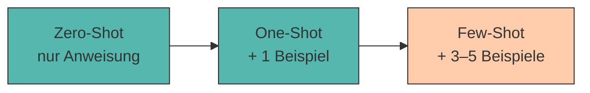

# 3. Zero-Shot, Few-Shot und Beispiel-basiertes Prompting

Manchmal genügt eine reine Anweisung, manchmal helfen **Beispiele** dem Modell, die gewünschte Antwort zu treffen. Die Wahl des richtigen Ansatzes ist eine zentrale Prompting-Entscheidung.

Der Name klingt technischer, als es ist: Ein **Shot** ist schlicht ein *Beispiel*, das du im Prompt mitlieferst. Kein Beispiel = Zero-Shot. Ein paar Beispiele = Few-Shot.

---

## Die drei Ansätze



=== "Zero-Shot"

    Du beschreibst die Aufgabe – ohne ein einziges Beispiel.

    ```title="zero_shot.txt"
    Klassifiziere die folgende Kundenbewertung als positiv, neutral
    oder negativ.

    Bewertung: "Die Lieferung kam pünktlich, aber das Gemüse war welk."
    ```

    **Gut für:** Standardaufgaben, die das Modell aus dem Training kennt (übersetzen, zusammenfassen, klassifizieren).

=== "One-Shot"

    Ein einziges Beispiel zeigt Format *und* Erwartungshaltung.

    ```title="one_shot.txt"
    Klassifiziere Kundenbewertungen.

    Bewertung: "Alles top, gerne wieder!"
    Bewertung: positiv
    Begründung: durchweg zufrieden

    Bewertung: "Die Lieferung kam pünktlich, aber das Gemüse war welk."
    ```

    **Gut für:** wenn vor allem das **Format** klar sein muss.

=== "Few-Shot"

    Mehrere Beispiele – idealerweise auch **Grenzfälle**.

    ```title="few_shot.txt"
    Klassifiziere Kundenbewertungen.

    Bewertung: "Alles top, gerne wieder!"
    Kategorie: positiv

    Bewertung: "Ware kam an. Nichts Besonderes."
    Kategorie: neutral

    Bewertung: "Zwei Tage zu spät und die Hälfte fehlte."
    Kategorie: negativ

    Bewertung: "Super Qualität, aber viel zu teuer."
    Kategorie: neutral

    Bewertung: "Die Lieferung kam pünktlich, aber das Gemüse war welk."
    Kategorie:
    ```

    **Gut für:** Aufgaben mit **eigenen Regeln**, Grenzfällen oder ungewöhnlichem Format.

???+ defi "In-Context Learning"

    Das Modell **lernt** durch Few-Shot-Prompting nicht wirklich dazu – seine Parameter ändern sich nicht. Es erkennt lediglich im Kontext ein **Muster** und setzt es fort. Fachbegriff: *In-Context Learning*[^brown].

    Deshalb ist die Wirkung nach dem Chat auch wieder weg. Wer dauerhaft ein Verhalten will, braucht Fine-Tuning – oder eine [Prompt Library](libraries.md).

---

## Vor- und Nachteile

<div style="text-align:center; max-width:760px; margin:16px auto;">
<table role="table"
       style="width:100%; border-collapse:separate; border-spacing:0; border:1px solid #cfd8e3; border-radius:10px; overflow:hidden; font-family:system-ui,sans-serif;">
    <thead>
    <tr style="background:#009485; color:#fff;">
        <th style="text-align:left; padding:12px 14px; font-weight:700;">Kriterium</th>
        <th style="text-align:center; padding:12px 14px; font-weight:700;">Zero-Shot</th>
        <th style="text-align:center; padding:12px 14px; font-weight:700;">Few-Shot</th>
    </tr>
    </thead>
    <tbody>
    <tr>
        <td style="background:#00948511; padding:10px 14px; font-weight:600;">Aufwand</td>
        <td style="padding:10px 14px; text-align:center;">sehr gering</td>
        <td style="padding:10px 14px; text-align:center;">hoch (Beispiele erstellen)</td>
    </tr>
    <tr>
        <td style="background:#00948511; padding:10px 14px; font-weight:600;">Formattreue</td>
        <td style="padding:10px 14px; text-align:center;">mäßig</td>
        <td style="padding:10px 14px; text-align:center;">sehr hoch</td>
    </tr>
    <tr>
        <td style="background:#00948511; padding:10px 14px; font-weight:600;">Token-Verbrauch</td>
        <td style="padding:10px 14px; text-align:center;">niedrig</td>
        <td style="padding:10px 14px; text-align:center;">hoch</td>
    </tr>
    <tr>
        <td style="background:#00948511; padding:10px 14px; font-weight:600;">Konsistenz</td>
        <td style="padding:10px 14px; text-align:center;">schwankend</td>
        <td style="padding:10px 14px; text-align:center;">stabil</td>
    </tr>
    <tr>
        <td style="background:#00948511; padding:10px 14px; font-weight:600;">Nutzen bei <em>kleinen</em> Modellen</td>
        <td style="padding:10px 14px; text-align:center;">gering</td>
        <td style="padding:10px 14px; text-align:center;">⭐ sehr groß</td>
    </tr>
    </tbody>
</table>
</div>

!!! tip "Der Kurs-Trick"

    Genau die letzte Zeile ist für uns entscheidend. Ein großes Modell braucht selten Beispiele – es rät richtig. **Kleine Modelle profitieren dramatisch von Few-Shot.** Wenn `gemma3:1b` deine Aufgabe partout nicht versteht: gib ihm zwei Beispiele, statt den Anweisungstext ein viertes Mal umzuformulieren.

---

## Wann welche Methode?

???+ process "Entscheidungshilfe"

    1. **Starte mit Zero-Shot.** Es ist billig und oft ausreichend.
    2. **Ergebnis stimmt inhaltlich, aber das Format wackelt?** → One-Shot mit einem exakten Musterbeispiel.
    3. **Das Modell versteht die Aufgabe grundsätzlich falsch?** → Few-Shot mit 3–5 Beispielen.
    4. **Es gibt Grenzfälle, die immer falsch klassifiziert werden?** → genau diese Grenzfälle als Beispiele aufnehmen.
    5. **Auch mit Few-Shot keine Besserung?** → Aufgabe ist zu groß. Zerlegen: [Prompt Chaining](chaining.md).

???+ defi "Was Beispiele wirklich leisten – ein überraschender Befund"

    Man würde annehmen, das Modell lerne aus Beispielen die **richtige Zuordnung**. Min et al.[^min] haben das geprüft und die Labels in den Beispielen **absichtlich falsch** gesetzt – „Alles top!" → *negativ*. Das Ergebnis: Die Leistung brach kaum ein.

    Was Beispiele tatsächlich vermitteln, sind drei andere Dinge:

    1. den **Label-Raum** (welche Antworten überhaupt zulässig sind),
    2. die **Eingabeverteilung** (wie die Aufgaben aussehen),
    3. das **Format** der Antwort.

    👉 Praktische Folgerung: Achte bei deinen Beispielen zuerst auf **Einheitlichkeit und Abdeckung** – nicht auf perfekt gewählte Musterlösungen.

!!! warning "Drei typische Few-Shot-Fallen"

    - **Unausgewogene Beispiele:** Nur positive Beispiele → das Modell klassifiziert alles als positiv. Decke *alle* Kategorien ab.[^zhao]
    - **Uneinheitliches Format:** Wenn deine Beispiele mal `Kategorie:` und mal `Bewertung:` schreiben, kopiert das Modell die Inkonsistenz.
    - **Zu viele Beispiele:** Ab ca. 5–8 Beispielen wird der Zugewinn klein, der Token-Verbrauch aber groß – und bei kleinen Modellen droht das [Kontextfenster](halluzinationen-kontextfenster.md) überzulaufen.

---

## 🔬 Ollama-Lab

Alles ab hier drehst du an **deiner eigenen Geschäftsidee**. Die Beispiele oben im Kapitel zeigen das Verfahren – hier wendest du es an. Terminal auf, `ollama run gemma3:1b`, los.

!!! lab "Übung 1: Zero-Shot vs. Few-Shot messen"

    Denk dir eine **Klassifikationsaufgabe** aus deinem Geschäftsfeld aus – etwa Kundenanfragen in *Beschwerde / Frage / Lob* einsortieren. Schreibe dir **fünf Testfälle** auf, darunter mindestens einen Grenzfall.

    Dann beide Varianten durchspielen:

    1. **Zero-Shot** – nur die Anweisung, dazu *„Antworte mit genau einem Wort."*
    2. **Few-Shot** – dieselbe Anweisung plus drei Beispiele, letztes Label offen lassen.

    **Zähle:** Wie oft bekommst du wirklich nur ein Wort zurück? Notiere beide Trefferquoten als Bruch.

!!! lab "Übung 2: Deinen Stil beibringen"

    Few-Shot überträgt **Stil** – etwas, das sich schwer beschreiben lässt.

    Schreibe zwei Produkt- oder Angebotsnamen im Stil deiner Idee selbst und lass das Modell den dritten ergänzen. Tausche danach die Beispiele gegen einen **völlig anderen** Stil (z. B. englische Tech-Namen) und wiederhole.

    **Die Frage:** Übernimmt das Modell den neuen Stil, ohne dass du ihn je beschrieben hast?

!!! lab "Übung 3: Business Model Canvas erzeugen"

    Jetzt das große Stück – dein Canvas, einmal auf beide Arten:

    1. **Zero-Shot:** *„Erstelle ein Business Model Canvas für [deine Idee]."* Zähle: Wie viele der neun Felder kommen?
    2. **Few-Shot:** Gib **zwei** vollständig ausgefüllte Felder eines *fremden* Beispiels vor (etwa für einen Fahrradkurier) und lass den Rest für deine Idee ergänzen.

    **Vergleiche** nach Vollständigkeit (0–9 Felder), Formattreue und inhaltlicher Substanz.

    Speichere den besseren Prompt in `prompts.md` unter `## 02 Canvas`.

??? code "🐍 Optional (Python): Few-Shot-Baukasten"

    Beispiele von Hand in jeden Prompt zu kopieren wird schnell mühsam. Diese Funktion baut den Prompt automatisch:

    ```python title="fewshot_builder.py"
    def baue_fewshot(anweisung, beispiele, neue_eingabe,
                     label_in="Eingabe", label_out="Ausgabe"):
        teile = [anweisung, ""]

        for eingabe, ausgabe in beispiele:
            teile.append(f"{label_in}: {eingabe}")
            teile.append(f"{label_out}: {ausgabe}")
            teile.append("")

        teile.append(f"{label_in}: {neue_eingabe}")
        teile.append(f"{label_out}:")      # bewusst offen lassen!

        return "\n".join(teile)


    prompt = baue_fewshot(
        "Klassifiziere Kundenbewertungen. Antworte mit genau einem Wort.",
        [("Alles top!", "positiv"), ("Kam zu spät.", "negativ")],
        "Preis okay, Qualität mittel.",
        label_in="Bewertung", label_out="Kategorie",
    )
    print(prompt)
    ```

    ```title="Ausgabe"
    Klassifiziere Kundenbewertungen. Antworte mit genau einem Wort.

    Bewertung: Alles top!
    Kategorie: positiv

    Bewertung: Kam zu spät.
    Kategorie: negativ

    Bewertung: Preis okay, Qualität mittel.
    Kategorie:
    ```

    Damit lässt sich der Prompt anschließend an `frage()` übergeben – und du kannst zwanzig Testfälle durchlaufen lassen, statt zwanzigmal zu tippen.

---

???+

---

???+ question "Selbsttest"

    1. Was ist ein „Shot" in Zero-/Few-Shot-Prompting?
    2. Warum profitieren kleine Modelle stärker von Few-Shot als große?
    3. Warum sollte das letzte Label im Few-Shot-Prompt offen bleiben?

    ??? success "Lösungsskizze"

        1. Ein **Beispiel** für die gewünschte Ein-/Ausgabe, das direkt im Prompt mitgeliefert wird.
        2. Große Modelle haben die Aufgabe im Training oft schon in ähnlicher Form gesehen und raten richtig. Kleine Modelle nicht – bei ihnen ersetzt das Beispiel dieses fehlende „Vorwissen".
        3. Weil das Modell Text **fortsetzt**. Ein abgebrochenes Muster ist die stärkste Aufforderung, es genau in dieser Form zu vollenden.

---

## Quellen

Zur Ausarbeitung wurden generative Tools unterstützend eingesetzt.

[^brown]: **Brown, T. B., Mann, B., Ryder, N. et al. (2020):** *Language Models are Few-Shot Learners.* arXiv:2005.14165. [https://arxiv.org/abs/2005.14165](https://arxiv.org/abs/2005.14165) — das Paper, das die Begriffe *Zero-Shot*, *One-Shot* und *Few-Shot* geprägt hat. Zeigt auch, dass der Nutzen von Beispielen mit der Modellgröße *abnimmt* – die Grundlage unseres Kurs-Tricks.
[^min]: **Min, S., Lyu, X., Holtzman, A. et al. (2022):** *Rethinking the Role of Demonstrations: What Makes In-Context Learning Work?* arXiv:2202.12837. [https://arxiv.org/abs/2202.12837](https://arxiv.org/abs/2202.12837) — überraschender Befund: Selbst **falsch gelabelte** Beispiele helfen kaum weniger als richtige. Entscheidend sind Format, Label-Raum und Eingabeverteilung – nicht die Korrektheit. Das erklärt, warum die *Struktur* deiner Beispiele so wichtig ist.
[^zhao]: **Zhao, T. Z., Wallace, E., Feng, S. et al. (2021):** *Calibrate Before Use: Improving Few-Shot Performance of Language Models.* arXiv:2102.09690. [https://arxiv.org/abs/2102.09690](https://arxiv.org/abs/2102.09690) — belegt die Verzerrung durch unausgewogene Beispiele: Das Modell bevorzugt Labels, die häufiger oder zuletzt im Prompt vorkommen.
[^osterwalder]: **Osterwalder, A. & Pigneur, Y. (2010):** *Business Model Generation: A Handbook for Visionaries, Game Changers, and Challengers.* Wiley, ISBN 978-0-470-87641-1.
